# PulseDesk Complete Knowledge Transfer Document

This document is a full technical handover for the PulseDesk project. It is written for a new developer who has never seen the codebase before and needs to understand, maintain, extend, debug, deploy, and rebuild it.

The current project folder is:

```text
E:\PulseDesk
```

The current source folders are:

```text
E:\PulseDesk\pulseDeskFrontEnd
E:\PulseDesk\pulseDeskBackEnd
```

Important current repository note:

- The folders were renamed from `client` and `server` to `pulseDeskFrontEnd` and `pulseDeskBackEnd`.
- Some root-level metadata still uses the old names:
  - `package.json` workspaces still reference `client` and `server`.
  - `package-lock.json` still references `client` and `server`.
  - `README.md` still mentions `client` and `server`.
  - `pulseDeskBackEnd/render.yaml` still says `rootDir: server`.
- Because of that, for local development, run commands from the actual renamed folders unless you update those config files.

Do not commit `.env` files. They contain local/private configuration.

---

## Section 1: Executive Overview

### Executive Summary

PulseDesk is a full-stack AI customer support automation platform. It lets customers create support tickets, lets support agents/admins manage those tickets, uses AI to triage issues, and supports real-time ticket chat.

The project solves a common business problem: support teams receive many issues, but manually reading, prioritizing, summarizing, assigning, replying, and tracking every issue is slow. PulseDesk automates parts of that work.

### Problem Solved

Support teams need to:

- Receive customer issues.
- Track each issue from open to resolved.
- Identify urgent tickets quickly.
- Understand customer sentiment.
- Reply faster.
- Collaborate in real time.
- Notify staff when important activity happens.
- Measure support performance.

PulseDesk handles these needs by combining a ticket system, AI analysis, real-time chat, role-based access, notifications, and analytics.

### Intended Users

Customer:

- Creates tickets.
- Uploads screenshots or files.
- Chats with support on ticket pages.
- Tracks issue status.

Support Agent:

- Views assigned or unassigned tickets.
- Replies to customers.
- Updates status and priority.
- Uses AI summary and suggested reply.
- Receives notifications.

Admin:

- Has staff-level access.
- Views all tickets.
- Views analytics.
- Views users/team list.
- Can assign and update tickets through backend API.

Developer/Maintainer:

- Runs backend/frontend locally.
- Maintains routes, controllers, models, UI, deployment configs.
- Adds future features such as assignment UI, Gemini support, password reset, tests, Docker, CI/CD.

### Main Business Goals

- Reduce support response time.
- Help staff identify urgent/angry customer issues.
- Centralize ticket conversation history.
- Improve support operations visibility.
- Provide a deployable MERN support platform foundation.
- Make AI assistance optional so the app still works without paid AI credentials.

### Key Features

Authentication:

- Signup.
- Login.
- JWT token generation.
- JWT token validation.
- Password hashing with bcrypt.
- Protected frontend routes.
- Role-based access for admin, agent, customer.

Ticket System:

- Create tickets.
- Store title, description, category, tags.
- Track status.
- Track priority.
- Assign staff through API.
- Upload attachments.
- Store AI analysis inside ticket document.

AI:

- Ticket summary.
- Suggested reply.
- Sentiment label and score.
- Automatic priority detection.
- OpenAI-backed when `OPENAI_API_KEY` exists.
- Local fallback rules when OpenAI is missing.

Real-Time:

- Socket.IO server.
- Socket.IO client.
- JWT-authenticated socket connections.
- Ticket rooms.
- Staff room.
- Live chat messages.
- Typing indicators.
- Live ticket list updates.

Dashboard:

- Total ticket count.
- Open ticket count.
- Resolved ticket count.
- Average response time.
- Staff-only analytics by status, priority, sentiment.
- Recent tickets.

Notifications:

- New ticket notifications for staff.
- Ticket update notifications for assigned user.
- Assignment notifications.
- Mark notification as read.

Uploads:

- Multer memory upload handling.
- File size limit.
- File count limit.
- File type validation.
- Cloudinary integration when configured.
- Local placeholder fallback when Cloudinary credentials are missing.

Email:

- Nodemailer integration.
- Assignment email.
- Development fallback logs when SMTP credentials are missing.

Deployment:

- Vercel config for frontend SPA rewrites.
- Render config for backend, though folder name needs updating.
- MongoDB Atlas compatible.

### Technologies Used

Frontend:

- React: UI library.
- Vite: fast React development/build tool.
- Tailwind CSS: utility-first styling.
- React Router: client-side routing.
- Axios: HTTP API requests.
- Socket.IO Client: real-time browser connection.
- Lucide React: icons.
- clsx: conditional class merging.

Backend:

- Node.js: JavaScript runtime.
- Express.js: HTTP API framework.
- MongoDB: document database.
- Mongoose: MongoDB ODM.
- Socket.IO: real-time communication.
- JWT: stateless authentication.
- bcryptjs: password hashing.
- Multer: multipart/form-data uploads.
- Cloudinary: external media storage.
- Nodemailer: email.
- OpenAI SDK: AI ticket analysis.
- Helmet: security headers.
- CORS: cross-origin browser API access.
- Morgan: request logging.
- express-rate-limit: basic abuse protection.
- dotenv: environment variable loading.

### Why These Technologies Were Chosen

MERN:

- JavaScript throughout frontend and backend.
- Easy for beginners to understand one language stack.
- React has strong ecosystem.
- Express is simple and common for APIs.
- MongoDB is flexible for tickets/messages with evolving schemas.
- Mongoose gives schema validation and model methods.

Socket.IO:

- Easier than raw WebSockets.
- Handles reconnection and rooms.
- Good for live chat and real-time updates.

JWT:

- Simple stateless auth.
- Easy to send through Axios headers and Socket.IO auth payload.

Tailwind:

- Fast UI styling without writing many CSS files.
- Responsive utilities are easy to apply.

OpenAI:

- Can generate JSON output for ticket summary/reply/sentiment/priority.
- Fallback rules keep the app functional without API key.

Cloudinary:

- Avoids storing files on backend server disk.
- Production-ready for media URLs.

Nodemailer:

- Standard Node email library.
- Works with many SMTP providers.

### Alternatives

Frontend alternatives:

- Next.js instead of Vite React.
- Vue or Angular instead of React.
- Material UI, Chakra UI, or shadcn/ui instead of Tailwind-only styling.

Backend alternatives:

- NestJS instead of Express for a more structured backend.
- Fastify instead of Express for performance.
- Prisma instead of Mongoose if using SQL or MongoDB through Prisma.

Database alternatives:

- PostgreSQL for relational support data.
- MySQL.
- Firebase/Firestore.

Auth alternatives:

- Auth0.
- Clerk.
- NextAuth.
- Session cookies instead of JWT localStorage.

AI alternatives:

- Gemini.
- Anthropic Claude.
- Azure OpenAI.
- Local LLMs.

Storage alternatives:

- AWS S3.
- Firebase Storage.
- Supabase Storage.

Email alternatives:

- SendGrid.
- Resend.
- Mailgun.
- Amazon SES.

### High-Level Architecture

PulseDesk has two main applications:

- React frontend in `pulseDeskFrontEnd`.
- Express backend in `pulseDeskBackEnd`.

The frontend sends REST API requests to the backend using Axios. The backend validates JWT tokens, executes controller logic, calls services, reads/writes MongoDB through Mongoose models, and returns JSON.

For real-time chat and ticket updates, the frontend also opens a Socket.IO connection to the backend. The socket connection is authenticated with the same JWT token used for REST APIs.

---

## Section 2: Complete Project Structure

### Hierarchical Project Tree

```text
PulseDesk/
|-- .git/
|-- node_modules/
|-- .gitignore
|-- package.json
|-- package-lock.json
|-- README.md
|-- KNOWLEDGE_TRANSFER.md
|-- pulseDeskBackEnd/
|   |-- .env
|   |-- .env.example
|   |-- package.json
|   |-- render.yaml
|   |-- src/
|       |-- app.js
|       |-- server.js
|       |-- config/
|       |   |-- cloudinary.js
|       |   |-- db.js
|       |   |-- env.js
|       |-- controllers/
|       |   |-- authController.js
|       |   |-- messageController.js
|       |   |-- notificationController.js
|       |   |-- ticketController.js
|       |-- middleware/
|       |   |-- auth.js
|       |   |-- errorHandler.js
|       |   |-- upload.js
|       |-- models/
|       |   |-- Message.js
|       |   |-- Notification.js
|       |   |-- Ticket.js
|       |   |-- User.js
|       |-- routes/
|       |   |-- authRoutes.js
|       |   |-- notificationRoutes.js
|       |   |-- ticketRoutes.js
|       |-- services/
|       |   |-- aiService.js
|       |   |-- mailService.js
|       |   |-- uploadService.js
|       |-- sockets/
|       |   |-- socketHandler.js
|       |-- utils/
|           |-- apiError.js
|           |-- asyncHandler.js
|           |-- jwt.js
|           |-- seed.js
|-- pulseDeskFrontEnd/
    |-- .env
    |-- .env.example
    |-- eslint.config.js
    |-- index.html
    |-- package.json
    |-- postcss.config.js
    |-- tailwind.config.js
    |-- vercel.json
    |-- vite.config.js
    |-- src/
        |-- App.jsx
        |-- index.css
        |-- main.jsx
        |-- api/
        |   |-- http.js
        |-- components/
        |   |-- Badge.jsx
        |   |-- MetricCard.jsx
        |   |-- ProtectedRoute.jsx
        |   |-- TicketCard.jsx
        |-- context/
        |   |-- AuthContext.jsx
        |-- hooks/
        |   |-- useSocket.js
        |-- layouts/
        |   |-- AppLayout.jsx
        |-- pages/
        |   |-- Dashboard.jsx
        |   |-- Login.jsx
        |   |-- NewTicket.jsx
        |   |-- Notifications.jsx
        |   |-- Signup.jsx
        |   |-- Team.jsx
        |   |-- TicketDetail.jsx
        |   |-- Tickets.jsx
        |-- utils/
            |-- format.js
```

### Folder-Level Explanation

`.git/`:

- Git metadata folder.
- Stores commits, refs, remotes, object database.
- Do not edit manually.

`node_modules/`:

- Installed dependencies.
- Generated by `npm install`.
- Can be removed and recreated with `npm install`.
- Should not be committed.

`pulseDeskBackEnd/`:

- Backend API application.
- Contains Node/Express server, database models, routes, controllers, services, middleware, sockets.

`pulseDeskFrontEnd/`:

- Frontend React application.
- Contains routes, pages, shared components, auth context, socket hook, styling.

### File Inventory

Importance levels:

- Critical: app cannot run correctly without it.
- High: major feature breaks without it.
- Medium: useful but not always required.
- Low: config/docs/dev helper.

| File | Purpose | Dependencies | Called By / Used By | Importance | Can Remove? | What Breaks If Removed? | Pattern |
|---|---|---|---|---|---|---|---|
| `.gitignore` | Tells Git what not to track | None | Git | Medium | No for clean repo | Secrets/build/dependencies may be committed accidentally | Config |
| `package.json` | Root npm scripts/workspaces | concurrently | npm | Medium | Yes if running folders separately | Root scripts unavailable | Monorepo config |
| `package-lock.json` | Dependency lockfile | npm | npm install | Medium | Can regenerate | Exact dependency versions lost | Lockfile |
| `README.md` | Basic project docs | None | Developers | Medium | Technically yes | New developers lose setup notes | Documentation |
| `KNOWLEDGE_TRANSFER.md` | Complete handover doc | None | Developers | Low | Yes | Handover knowledge lost | Documentation |
| `pulseDeskBackEnd/package.json` | Backend npm config | All backend packages | npm | Critical | No | Backend cannot install/run easily | Package manifest |
| `pulseDeskBackEnd/.env` | Actual local env | dotenv | env.js | Critical locally | No unless replaced | DB/auth/config missing | Runtime config |
| `pulseDeskBackEnd/.env.example` | Env template | None | Developers | Medium | Not for production | Setup guidance missing | Documentation/config |
| `pulseDeskBackEnd/render.yaml` | Render deployment blueprint | Render | Render deploy | Low/Medium | Yes if manual deploy | Render blueprint unavailable | IaC-lite |
| `pulseDeskBackEnd/src/server.js` | Starts backend server | http, Socket.IO, app, DB | npm start/dev | Critical | No | Backend never starts | Entry point |
| `pulseDeskBackEnd/src/app.js` | Builds Express app | Express middleware/routes | server.js | Critical | No | API routes/middleware unavailable | App factory |
| `pulseDeskBackEnd/src/config/env.js` | Loads env config | dotenv | Most backend files | Critical | No | Config becomes scattered/missing | Central config |
| `pulseDeskBackEnd/src/config/db.js` | MongoDB connection | mongoose, env | server.js, seed.js | Critical | No | DB cannot connect | Infrastructure config |
| `pulseDeskBackEnd/src/config/cloudinary.js` | Cloudinary SDK setup | cloudinary, env | uploadService | High for uploads | Can remove only if no Cloudinary | Uploads fail when configured | External service config |
| `pulseDeskBackEnd/src/models/User.js` | User schema/model | mongoose, bcrypt, validator | auth, sockets, seed, tickets | Critical | No | Auth/users break | Active Record/Mongoose model |
| `pulseDeskBackEnd/src/models/Ticket.js` | Ticket schema/model | mongoose | ticket/message/socket controllers | Critical | No | Ticket system breaks | Mongoose model |
| `pulseDeskBackEnd/src/models/Message.js` | Message schema/model | mongoose | message/ticket/socket | High | No | Chat/history breaks | Mongoose model |
| `pulseDeskBackEnd/src/models/Notification.js` | Notification schema/model | mongoose | notifications/tickets | High | No for notifications | Notifications break | Mongoose model |
| `pulseDeskBackEnd/src/middleware/auth.js` | JWT auth/RBAC middleware | ApiError, asyncHandler, jwt, User | routes, sockets indirectly | Critical | No | Protected APIs insecure/broken | Middleware |
| `pulseDeskBackEnd/src/middleware/errorHandler.js` | Central error response | env | app.js | Critical | No | Bad/unstructured error handling | Middleware |
| `pulseDeskBackEnd/src/middleware/upload.js` | Multer file parser | multer, ApiError | ticketRoutes | High | No for uploads | File upload endpoints break | Middleware |
| `pulseDeskBackEnd/src/utils/apiError.js` | Custom HTTP error class | Error | controllers/middleware | High | Can replace | Error statuses lost | Utility |
| `pulseDeskBackEnd/src/utils/asyncHandler.js` | Async error wrapper | None | controllers/middleware | High | Can replace | Async errors may not reach handler | Utility/HOF |
| `pulseDeskBackEnd/src/utils/jwt.js` | JWT sign/verify helpers | jsonwebtoken, env | auth, sockets | Critical | No | Auth tokens break | Utility |
| `pulseDeskBackEnd/src/utils/seed.js` | Demo user seed script | DB, User | npm run seed | Medium | Yes | Demo users not created | Script |
| `pulseDeskBackEnd/src/services/aiService.js` | AI/fallback ticket analysis | OpenAI, env | ticketController | High | No for AI features | Summary/sentiment/priority automation breaks | Service |
| `pulseDeskBackEnd/src/services/uploadService.js` | Cloudinary/local upload abstraction | stream, cloudinary, env | ticket/message controllers | High | No for uploads | Attachments break | Service |
| `pulseDeskBackEnd/src/services/mailService.js` | SMTP email abstraction | nodemailer, env | assignTicket | Medium | Yes if no emails | Assignment emails break | Service |
| `pulseDeskBackEnd/src/controllers/authController.js` | Auth business logic | User, JWT, ApiError | authRoutes | Critical | No | Login/signup/me/users break | Controller |
| `pulseDeskBackEnd/src/controllers/ticketController.js` | Ticket business logic | Ticket, Message, Notification, User, services | ticketRoutes | Critical | No | Ticket system breaks | Controller |
| `pulseDeskBackEnd/src/controllers/messageController.js` | REST message replies | Ticket, Message, uploadService | ticketRoutes | High | No | REST replies break | Controller |
| `pulseDeskBackEnd/src/controllers/notificationController.js` | Notification logic | Notification | notificationRoutes | High | No | Notifications page breaks | Controller |
| `pulseDeskBackEnd/src/routes/authRoutes.js` | Auth route mapping | express, controllers, middleware | app.js | Critical | No | Auth endpoints unavailable | Router |
| `pulseDeskBackEnd/src/routes/ticketRoutes.js` | Ticket route mapping | express, controllers, auth, upload | app.js | Critical | No | Ticket endpoints unavailable | Router |
| `pulseDeskBackEnd/src/routes/notificationRoutes.js` | Notification route mapping | express, controller, auth | app.js | High | No | Notification endpoints unavailable | Router |
| `pulseDeskBackEnd/src/sockets/socketHandler.js` | Socket auth/events/rooms | jwt, User, Ticket, Message | server.js | High | No for realtime | Chat/live updates break | Event handler |
| `pulseDeskFrontEnd/package.json` | Frontend npm config | React/Vite/etc | npm | Critical | No | Frontend cannot install/run easily | Package manifest |
| `pulseDeskFrontEnd/.env` | Actual frontend env | Vite | http.js/useSocket.js | Critical locally | No unless env provided another way | API/socket URLs missing | Runtime config |
| `pulseDeskFrontEnd/.env.example` | Frontend env template | None | Developers | Medium | Yes | Setup guidance missing | Documentation/config |
| `pulseDeskFrontEnd/index.html` | Browser HTML shell | main.jsx | Vite | Critical | No | React app cannot mount | App shell |
| `pulseDeskFrontEnd/vite.config.js` | Vite config | Vite React plugin | Vite | High | Can use defaults partly | Port/plugin config lost | Build config |
| `pulseDeskFrontEnd/tailwind.config.js` | Tailwind theme/config | Tailwind | Vite/PostCSS | High | No for custom theme | Styling utilities/theme break | Style config |
| `pulseDeskFrontEnd/postcss.config.js` | Tailwind/PostCSS pipeline | tailwind, autoprefixer | Vite | High | No | Tailwind build breaks | Build config |
| `pulseDeskFrontEnd/eslint.config.js` | Lint rules | ESLint plugins | npm run lint | Medium | Yes | Lint unavailable | Quality config |
| `pulseDeskFrontEnd/vercel.json` | Vercel SPA rewrite | Vercel | Vercel deploy | Medium | Yes if configured manually | Refresh/direct routes fail on Vercel | Deployment config |
| `pulseDeskFrontEnd/src/main.jsx` | React entry | ReactDOM, Router, AuthProvider, App | index.html | Critical | No | Frontend cannot start | Entry point |
| `pulseDeskFrontEnd/src/App.jsx` | Route definitions | React Router, pages | main.jsx | Critical | No | Navigation/routing breaks | Routing component |
| `pulseDeskFrontEnd/src/index.css` | Global CSS/Tailwind | Tailwind | main.jsx | High | No for styling | Styling/focus utilities lost | Global style |
| `pulseDeskFrontEnd/src/api/http.js` | Axios API client | axios, localStorage | pages/context | Critical | No | API calls lose base URL/auth | API client |
| `pulseDeskFrontEnd/src/context/AuthContext.jsx` | Auth state provider | React hooks, http | main/components/pages | Critical | No | Login/protected routes break | Context/provider |
| `pulseDeskFrontEnd/src/hooks/useSocket.js` | Socket client hook | socket.io-client, useAuth | ticket pages/list | High | No for realtime | Realtime features break | Custom hook |
| `pulseDeskFrontEnd/src/layouts/AppLayout.jsx` | Main protected layout | Router, auth, icons | App routes | High | No | Protected pages lose shell/nav | Layout component |
| `pulseDeskFrontEnd/src/components/Badge.jsx` | Badge UI | clsx, format | TicketCard/TicketDetail | Medium | Can replace | Status/priority UI affected | Presentational component |
| `pulseDeskFrontEnd/src/components/MetricCard.jsx` | Metric UI | None | Dashboard | Medium | Can replace | Dashboard UI affected | Presentational component |
| `pulseDeskFrontEnd/src/components/ProtectedRoute.jsx` | Route guard | Router, AuthContext | App.jsx | Critical | No | Unauthorized access/routing broken | Guard component |
| `pulseDeskFrontEnd/src/components/TicketCard.jsx` | Ticket list item | Router, Badge, format | Dashboard/Tickets | High | No for list UI | Ticket lists lose rendering | Presentational/navigation |
| `pulseDeskFrontEnd/src/pages/Login.jsx` | Login page/shared auth UI | hooks, auth, router, icons | App.jsx | Critical | No | Login unavailable | Page component |
| `pulseDeskFrontEnd/src/pages/Signup.jsx` | Signup page | hooks, auth, router | App.jsx | High | No for signup | Signup unavailable | Page component |
| `pulseDeskFrontEnd/src/pages/Dashboard.jsx` | Metrics/recent tickets page | http, auth, MetricCard, TicketCard | App.jsx | High | No | Dashboard unavailable | Page component |
| `pulseDeskFrontEnd/src/pages/Tickets.jsx` | Ticket list/search/realtime | http, socket, TicketCard | App.jsx | High | No | Ticket browsing unavailable | Page component |
| `pulseDeskFrontEnd/src/pages/NewTicket.jsx` | Ticket creation form | http, FormData, router | App.jsx | High | No | Ticket creation unavailable | Page component |
| `pulseDeskFrontEnd/src/pages/TicketDetail.jsx` | Ticket detail/chat/AI/control | http, socket, auth, Badge | App.jsx | Critical | No | Chat/detail/update unavailable | Page component |
| `pulseDeskFrontEnd/src/pages/Notifications.jsx` | Notification list/read | http, router, format | App.jsx | High | No | Notifications UI unavailable | Page component |
| `pulseDeskFrontEnd/src/pages/Team.jsx` | Staff user table | http | App.jsx | Medium | Yes if no team UI | Team page unavailable | Page component |
| `pulseDeskFrontEnd/src/utils/format.js` | Date/text/class helpers | Intl | components/pages | Medium | Can inline | Formatting classes duplicated/lost | Utility |

---

## Section 3: System Architecture

### Logical Architecture

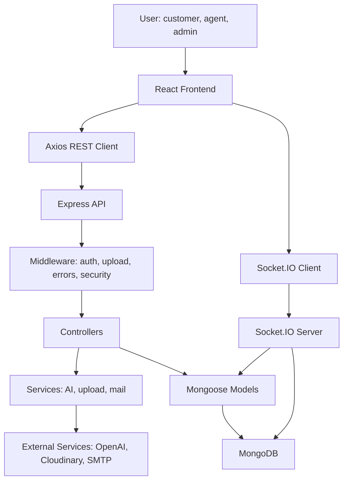
```mermaid
flowchart TD
    User["User: customer, agent, admin"]
    Browser["React Frontend"]
    Axios["Axios REST Client"]
    SocketClient["Socket.IO Client"]
    API["Express API"]
    SocketServer["Socket.IO Server"]
    Middleware["Middleware: auth, upload, errors, security"]
    Controllers["Controllers"]
    Services["Services: AI, upload, mail"]
    Models["Mongoose Models"]
    DB["MongoDB"]
    External["External Services: OpenAI, Cloudinary, SMTP"]

    User --> Browser
    Browser --> Axios
    Browser --> SocketClient
    Axios --> API
    SocketClient --> SocketServer
    API --> Middleware
    Middleware --> Controllers
    Controllers --> Services
    Controllers --> Models
    Services --> External
    Models --> DB
    SocketServer --> Models
    SocketServer --> DB
```

### Physical Architecture

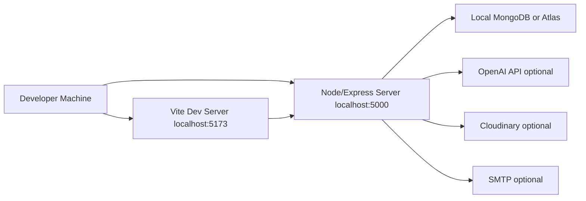
```mermaid
flowchart LR
    DevMachine["Developer Machine"]
    FE["Vite Dev Server localhost:5173"]
    BE["Node/Express Server localhost:5000"]
    Mongo["Local MongoDB or Atlas"]
    OpenAI["OpenAI API optional"]
    Cloudinary["Cloudinary optional"]
    SMTP["SMTP optional"]

    DevMachine --> FE
    DevMachine --> BE
    FE --> BE
    BE --> Mongo
    BE --> OpenAI
    BE --> Cloudinary
    BE --> SMTP
```

### Deployment Architecture

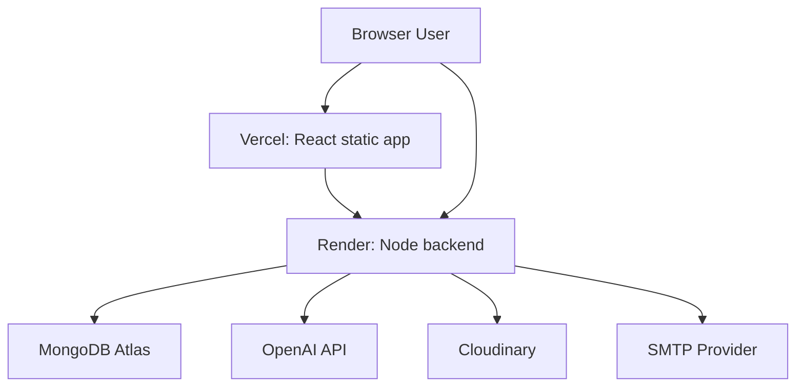
```mermaid
flowchart TD
    User["Browser User"]
    Vercel["Vercel: React static app"]
    Render["Render: Node backend"]
    Atlas["MongoDB Atlas"]
    OpenAI["OpenAI API"]
    Cloudinary["Cloudinary"]
    SMTP["SMTP Provider"]

    User --> Vercel
    Vercel --> Render
    User --> Render
    Render --> Atlas
    Render --> OpenAI
    Render --> Cloudinary
    Render --> SMTP
```

Note: `render.yaml` currently needs `rootDir` updated from `server` to `pulseDeskBackEnd`.

### Component Architecture

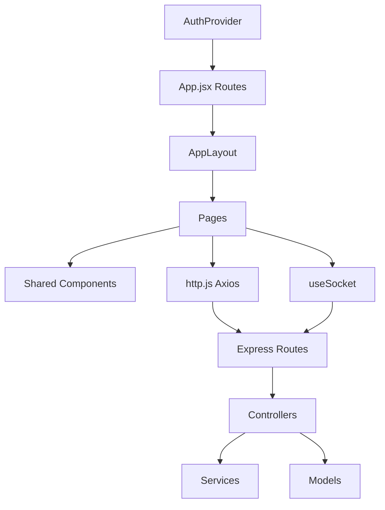
```mermaid
flowchart TD
    App["App.jsx Routes"]
    AuthProvider["AuthProvider"]
    Layout["AppLayout"]
    Pages["Pages"]
    Shared["Shared Components"]
    Http["http.js Axios"]
    SocketHook["useSocket"]
    BackendRoutes["Express Routes"]
    BackendControllers["Controllers"]
    BackendServices["Services"]
    BackendModels["Models"]

    AuthProvider --> App
    App --> Layout
    Layout --> Pages
    Pages --> Shared
    Pages --> Http
    Pages --> SocketHook
    Http --> BackendRoutes
    SocketHook --> BackendRoutes
    BackendRoutes --> BackendControllers
    BackendControllers --> BackendServices
    BackendControllers --> BackendModels
```

### Layered Architecture

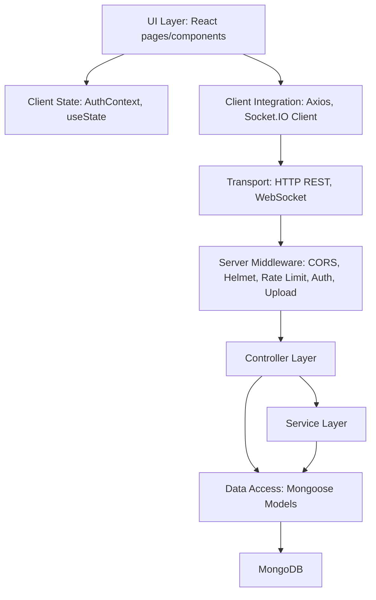
```mermaid
flowchart TD
    UI["UI Layer: React pages/components"]
    ClientState["Client State: AuthContext, useState"]
    ClientIntegration["Client Integration: Axios, Socket.IO Client"]
    Transport["Transport: HTTP REST, WebSocket"]
    ServerMiddleware["Server Middleware: CORS, Helmet, Rate Limit, Auth, Upload"]
    ServerControllers["Controller Layer"]
    ServerServices["Service Layer"]
    DataAccess["Data Access: Mongoose Models"]
    Database["MongoDB"]

    UI --> ClientState
    UI --> ClientIntegration
    ClientIntegration --> Transport
    Transport --> ServerMiddleware
    ServerMiddleware --> ServerControllers
    ServerControllers --> ServerServices
    ServerControllers --> DataAccess
    ServerServices --> DataAccess
    DataAccess --> Database
```

### Architectural Patterns Used

- MVC-inspired backend:
  - Models in `models/`.
  - Controllers in `controllers/`.
  - Routes in `routes/`.
- Service layer:
  - AI, upload, mail are isolated in `services/`.
- Middleware pattern:
  - Auth, upload, error handling, rate limiting.
- Context provider:
  - Frontend auth state is shared through React Context.
- Custom hook:
  - `useSocket()` encapsulates socket connection.
- App factory:
  - `createApp(io)` builds and returns an Express app.
- Event-driven real-time:
  - Socket.IO rooms and events.

---

## Section 4: Request Flow Analysis

### User Login Flow

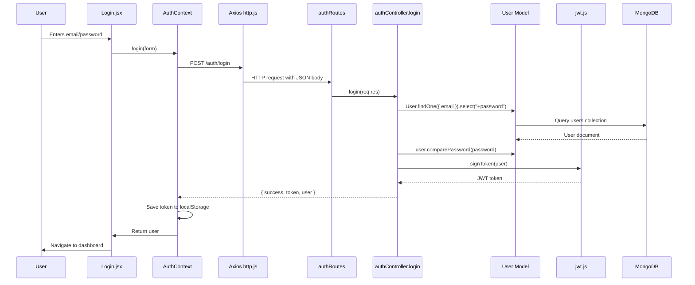
```mermaid
sequenceDiagram
    participant U as User
    participant L as Login.jsx
    participant A as AuthContext
    participant H as Axios http.js
    participant R as authRoutes
    participant C as authController.login
    participant M as User Model
    participant J as jwt.js
    participant DB as MongoDB

    U->>L: Enters email/password
    L->>A: login(form)
    A->>H: POST /auth/login
    H->>R: HTTP request with JSON body
    R->>C: login(req,res)
    C->>M: User.findOne({ email }).select("+password")
    M->>DB: Query users collection
    DB-->>M: User document
    C->>M: user.comparePassword(password)
    C->>J: signToken(user)
    J-->>C: JWT token
    C-->>A: { success, token, user }
    A->>A: Save token to localStorage
    A->>L: Return user
    L->>U: Navigate to dashboard
```

Technical details:

- Login page uses `useState` to store form data.
- `submit()` prevents default browser form refresh.
- `AuthContext.login()` sends request.
- Backend loads user with password explicitly because password has `select: false`.
- `comparePassword()` uses bcrypt.
- JWT contains user id and role.
- Frontend stores JWT in localStorage.

### User Registration Flow

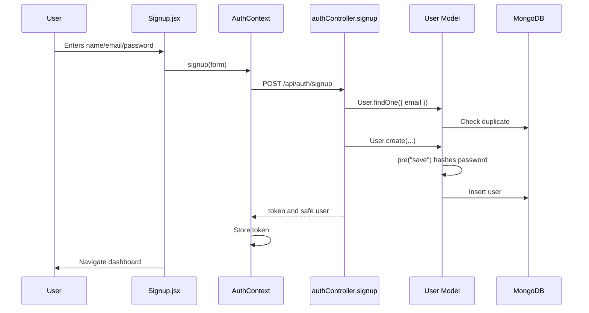
```mermaid
sequenceDiagram
    participant U as User
    participant S as Signup.jsx
    participant A as AuthContext
    participant C as authController.signup
    participant M as User Model
    participant DB as MongoDB

    U->>S: Enters name/email/password
    S->>A: signup(form)
    A->>C: POST /api/auth/signup
    C->>M: User.findOne({ email })
    M->>DB: Check duplicate
    C->>M: User.create(...)
    M->>M: pre("save") hashes password
    M->>DB: Insert user
    C-->>A: token and safe user
    A->>A: Store token
    S->>U: Navigate dashboard
```

Important behavior:

- Public signup always creates `customer`.
- `safeRole` only accepts requested role if `req.user?.role === "admin"`.
- Public signup does not have `req.user`, so public users cannot create themselves as admin.

### Create Ticket With Upload and AI Flow

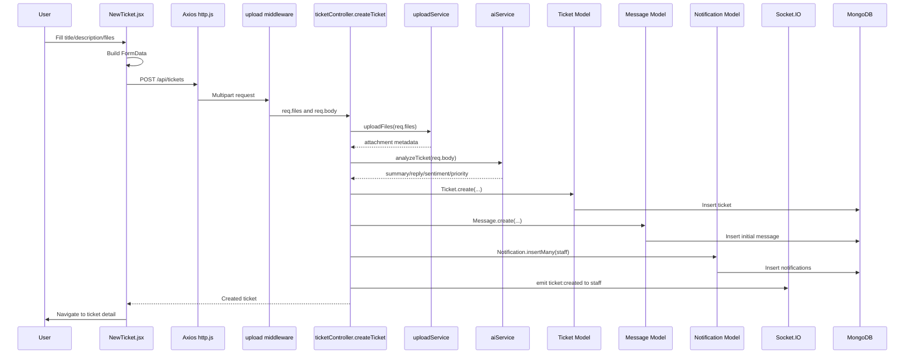
```mermaid
sequenceDiagram
    participant U as User
    participant N as NewTicket.jsx
    participant H as Axios http.js
    participant UR as upload middleware
    participant TC as ticketController.createTicket
    participant US as uploadService
    participant AI as aiService
    participant T as Ticket Model
    participant M as Message Model
    participant Ntf as Notification Model
    participant IO as Socket.IO
    participant DB as MongoDB

    U->>N: Fill title/description/files
    N->>N: Build FormData
    N->>H: POST /api/tickets
    H->>UR: Multipart request
    UR->>TC: req.files and req.body
    TC->>US: uploadFiles(req.files)
    US-->>TC: attachment metadata
    TC->>AI: analyzeTicket(req.body)
    AI-->>TC: summary/reply/sentiment/priority
    TC->>T: Ticket.create(...)
    T->>DB: Insert ticket
    TC->>M: Message.create(...)
    M->>DB: Insert initial message
    TC->>Ntf: Notification.insertMany(staff)
    Ntf->>DB: Insert notifications
    TC->>IO: emit ticket:created to staff
    TC-->>N: Created ticket
    N->>U: Navigate to ticket detail
```

### Ticket List and Search Flow

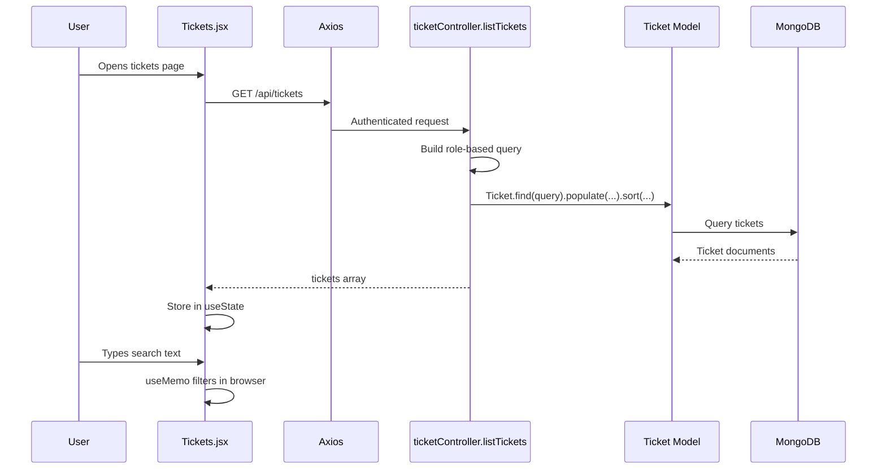
```mermaid
sequenceDiagram
    participant U as User
    participant P as Tickets.jsx
    participant H as Axios
    participant C as ticketController.listTickets
    participant T as Ticket Model
    participant DB as MongoDB

    U->>P: Opens tickets page
    P->>H: GET /api/tickets
    H->>C: Authenticated request
    C->>C: Build role-based query
    C->>T: Ticket.find(query).populate(...).sort(...)
    T->>DB: Query tickets
    DB-->>T: Ticket documents
    C-->>P: tickets array
    P->>P: Store in useState
    U->>P: Types search text
    P->>P: useMemo filters in browser
```

Search is frontend-only in the current implementation. The backend has a text index, but no backend search endpoint uses it yet.

### Ticket Update Flow

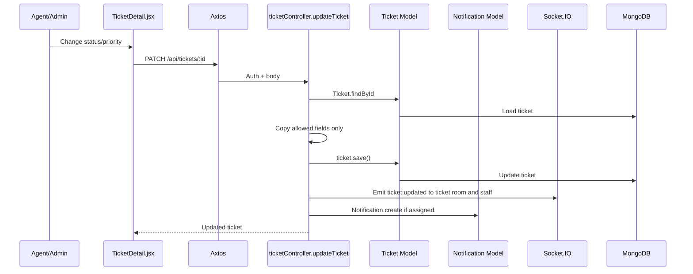
```mermaid
sequenceDiagram
    participant Staff as Agent/Admin
    participant TD as TicketDetail.jsx
    participant H as Axios
    participant C as ticketController.updateTicket
    participant T as Ticket Model
    participant N as Notification Model
    participant IO as Socket.IO
    participant DB as MongoDB

    Staff->>TD: Change status/priority
    TD->>H: PATCH /api/tickets/:id
    H->>C: Auth + body
    C->>T: Ticket.findById
    T->>DB: Load ticket
    C->>C: Copy allowed fields only
    C->>T: ticket.save()
    T->>DB: Update ticket
    C->>IO: Emit ticket:updated to ticket room and staff
    C->>N: Notification.create if assigned
    C-->>TD: Updated ticket
```

### Live Chat Flow

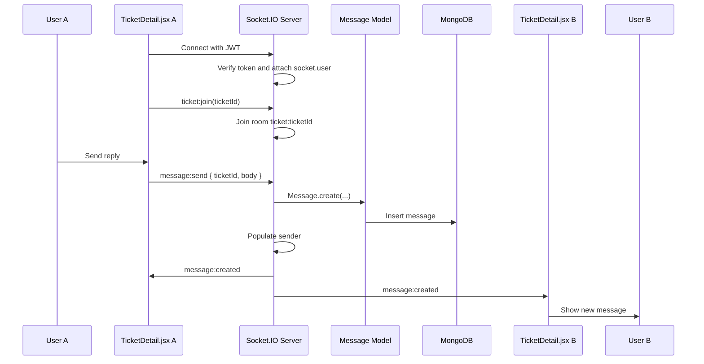
```mermaid
sequenceDiagram
    participant U1 as User A
    participant F1 as TicketDetail.jsx A
    participant S as Socket.IO Server
    participant M as Message Model
    participant DB as MongoDB
    participant F2 as TicketDetail.jsx B
    participant U2 as User B

    F1->>S: Connect with JWT
    S->>S: Verify token and attach socket.user
    F1->>S: ticket:join(ticketId)
    S->>S: Join room ticket:ticketId
    U1->>F1: Send reply
    F1->>S: message:send { ticketId, body }
    S->>M: Message.create(...)
    M->>DB: Insert message
    S->>S: Populate sender
    S->>F1: message:created
    S->>F2: message:created
    F2->>U2: Show new message
```

### Notification Flow

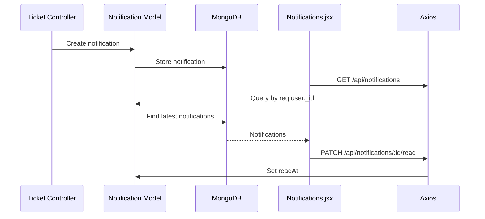
```mermaid
sequenceDiagram
    participant C as Ticket Controller
    participant N as Notification Model
    participant DB as MongoDB
    participant P as Notifications.jsx
    participant H as Axios

    C->>N: Create notification
    N->>DB: Store notification
    P->>H: GET /api/notifications
    H->>N: Query by req.user._id
    N->>DB: Find latest notifications
    DB-->>P: Notifications
    P->>H: PATCH /api/notifications/:id/read
    H->>N: Set readAt
```

### Seed Demo Users Flow

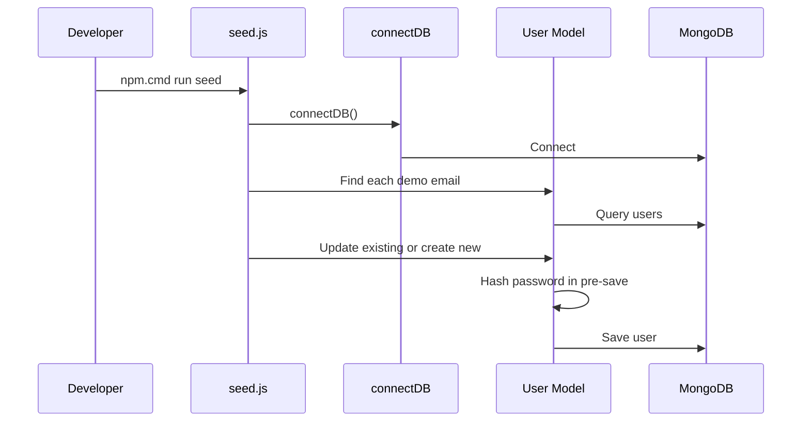
```mermaid
sequenceDiagram
    participant Dev as Developer
    participant Seed as seed.js
    participant DB as connectDB
    participant User as User Model
    participant Mongo as MongoDB

    Dev->>Seed: npm.cmd run seed
    Seed->>DB: connectDB()
    DB->>Mongo: Connect
    Seed->>User: Find each demo email
    User->>Mongo: Query users
    Seed->>User: Update existing or create new
    User->>User: Hash password in pre-save
    User->>Mongo: Save user
```

---

## Section 5: Frontend Deep Dive

### Frontend Runtime Concepts for Beginners

React component:

- A JavaScript function that returns JSX.
- JSX looks like HTML but is JavaScript.
- Example: `<Dashboard />`.

Props:

- Inputs passed to a component.
- Example: `<MetricCard label="Open tickets" value={3} />`.

State:

- Component memory.
- `useState()` creates state.
- When state changes, React re-renders the component.

Hook:

- Special React function starting with `use`.
- `useState`, `useEffect`, `useMemo`, `useContext`.

`useEffect`:

- Runs side effects like API calls.
- Often runs after page renders.

`useMemo`:

- Recomputes a value only when dependencies change.
- Used for derived metrics/filtering.

`useContext`:

- Reads shared app state from a provider.
- Used for auth state.

### Component Tree

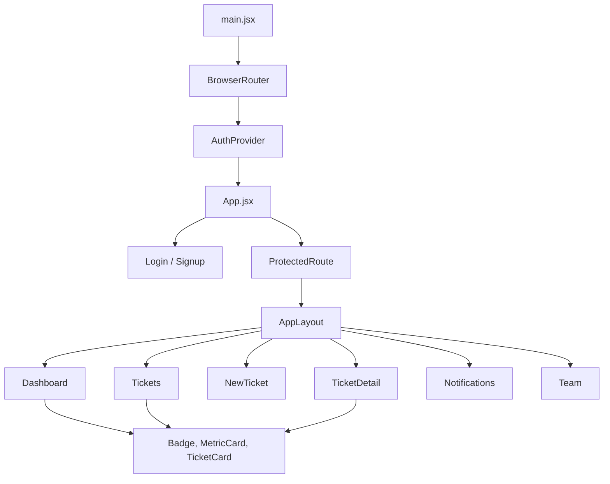
```mermaid
flowchart TD
    main["main.jsx"]
    Router["BrowserRouter"]
    Auth["AuthProvider"]
    App["App.jsx"]
    Public["Login / Signup"]
    Protected["ProtectedRoute"]
    Layout["AppLayout"]
    Dashboard["Dashboard"]
    Tickets["Tickets"]
    NewTicket["NewTicket"]
    TicketDetail["TicketDetail"]
    Notifications["Notifications"]
    Team["Team"]
    Components["Badge, MetricCard, TicketCard"]

    main --> Router
    Router --> Auth
    Auth --> App
    App --> Public
    App --> Protected
    Protected --> Layout
    Layout --> Dashboard
    Layout --> Tickets
    Layout --> NewTicket
    Layout --> TicketDetail
    Layout --> Notifications
    Layout --> Team
    Dashboard --> Components
    Tickets --> Components
    TicketDetail --> Components
```

### `pulseDeskFrontEnd/src/main.jsx`

Purpose:

- Starts the React app.
- Mounts the app into the browser DOM.

Line-by-line:

```jsx
import React from "react";
```

Imports React. Even though modern JSX does not always need React imported, it is still commonly included.

```jsx
import ReactDOM from "react-dom/client";
```

Imports ReactDOM client renderer. This is what connects React to actual browser HTML.

```jsx
import { BrowserRouter } from "react-router-dom";
```

Imports the router wrapper. It enables browser routes like `/dashboard`.

```jsx
import App from "./App.jsx";
```

Imports the main route component.

```jsx
import { AuthProvider } from "./context/AuthContext.jsx";
```

Imports the auth provider so the whole app can access login state.

```jsx
import "./index.css";
```

Loads global CSS and Tailwind styles.

```jsx
ReactDOM.createRoot(document.getElementById("root")).render(...)
```

Finds `<div id="root"></div>` in `index.html`, creates a React root, and renders the app.

Inside render:

- `<React.StrictMode>` enables development checks.
- `<BrowserRouter>` enables routes.
- `<AuthProvider>` provides auth state.
- `<App />` renders route definitions.

### `pulseDeskFrontEnd/src/App.jsx`

Purpose:

- Defines all frontend routes.
- Separates public routes from protected routes.
- Restricts `/team` to admin/agent roles.

Important imports:

- `Navigate`, `Route`, `Routes` from React Router.
- `ProtectedRoute` route guard.
- Layout and pages.

Flow:

- `/login` renders `Login`.
- `/signup` renders `Signup`.
- Protected wrapper checks authentication.
- Authenticated users get `AppLayout`.
- `/` redirects to `/dashboard`.
- Unknown routes redirect to `/dashboard`.

Why nested routes are used:

- `ProtectedRoute` guards many routes at once.
- `AppLayout` wraps all protected pages with sidebar/header.
- `Outlet` inside layout renders the active page.

### `pulseDeskFrontEnd/src/api/http.js`

Purpose:

- Central Axios client for all API calls.
- Automatically adds JWT token.
- Removes token when backend says unauthorized.

Line-by-line:

```js
import axios from "axios";
```

Imports Axios.

```js
export const API_URL = import.meta.env.VITE_API_URL || "http://localhost:5000/api";
```

Reads Vite env variable. If missing, uses local backend API URL.

```js
export const http = axios.create({ baseURL: API_URL });
```

Creates reusable Axios instance. Calling `http.get("/tickets")` actually calls `http://localhost:5000/api/tickets`.

Request interceptor:

```js
http.interceptors.request.use((config) => { ... });
```

Runs before every request.

```js
const token = localStorage.getItem("pulsedesk_token");
```

Reads JWT from browser localStorage.

```js
if (token) config.headers.Authorization = `Bearer ${token}`;
```

Adds authorization header.

Backend expects:

```text
Authorization: Bearer <token>
```

Response interceptor:

```js
if (error.response?.status === 401) {
  localStorage.removeItem("pulsedesk_token");
}
```

If backend returns unauthorized, frontend removes token.

### `pulseDeskFrontEnd/src/context/AuthContext.jsx`

Purpose:

- Stores authentication state globally.
- Provides `login`, `signup`, `logout`, `isStaff`.

State:

- `user`: current user object.
- `token`: JWT token.
- `loading`: whether app is checking saved token.

Important functions:

`AuthProvider({ children })`:

- Wraps the app.
- Makes auth values available to children.

`useEffect(loadMe)`:

- Runs when token changes.
- If token exists, calls `/auth/me`.
- If token invalid, removes it.

`login(payload)`:

- Sends `POST /auth/login`.
- Saves token to localStorage.
- Updates state.

`signup(payload)`:

- Sends `POST /auth/signup`.
- Saves token and user.

`logout()`:

- Removes token.
- Clears user state.

`isStaff`:

- True when role is `admin` or `agent`.
- Used to show staff-only UI.

`useAuth()`:

- Shortcut hook.
- Any component can call `const { user } = useAuth()`.

### `pulseDeskFrontEnd/src/hooks/useSocket.js`

Purpose:

- Opens a Socket.IO connection when user has a token.
- Closes connection when component unmounts.

Logic:

- Reads token from `useAuth()`.
- Uses `io(SOCKET_URL, { auth: { token } })`.
- Backend reads token from `socket.handshake.auth.token`.
- Returns socket object to pages.

Used by:

- `Tickets.jsx`.
- `TicketDetail.jsx`.

### `pulseDeskFrontEnd/src/components/ProtectedRoute.jsx`

Purpose:

- Guards protected pages.

Logic:

- If auth is loading, show loading UI.
- If no user, redirect to `/login`.
- If roles were provided and user role is not included, redirect to `/dashboard`.
- Otherwise render child route through `<Outlet />`.

### `pulseDeskFrontEnd/src/layouts/AppLayout.jsx`

Purpose:

- Main layout for logged-in users.
- Shows sidebar navigation, header, current user info, logout button.

State/hooks:

- Uses `useAuth()` for user, logout, isStaff.
- Uses `useNavigate()` to redirect after logout.

Navigation items:

- Dashboard.
- Tickets.
- New Ticket.
- Alerts.
- Team, staff only.

Why `staffOnly` exists:

- Customers should not see Team page.

### `pulseDeskFrontEnd/src/pages/Login.jsx`

Purpose:

- Login form.
- Shared auth screen layout and input component.

State:

- `form`: email/password.
- `error`: error message from backend.

Default form:

- Email: `admin@pulsedesk.dev`.
- Password: `Password123`.

`submit(event)`:

- Prevents browser page reload.
- Clears previous error.
- Calls `login(form)`.
- Navigates to `/dashboard`.
- Shows backend error if login fails.

Exports:

- `Login`.
- `AuthScreen`.
- `Input`.

`AuthScreen`:

- Reusable two-column auth layout.
- Used by Login and Signup.

`Input`:

- Reusable controlled input.
- Controlled means its value is stored in React state.

### `pulseDeskFrontEnd/src/pages/Signup.jsx`

Purpose:

- Signup form.

State:

- `form`: name, email, password, role.
- `error`: backend error.

Important detail:

- Frontend form includes role default `customer`.
- Backend protects role assignment, so public signup still becomes customer.

### `pulseDeskFrontEnd/src/pages/Dashboard.jsx`

Purpose:

- Shows support metrics and recent tickets.

State:

- `tickets`: list of tickets.
- `analytics`: staff-only analytics object.

Hooks:

- `useEffect`: loads tickets and analytics.
- `useMemo`: calculates metrics efficiently.

API calls:

- `GET /tickets`.
- `GET /tickets/analytics` for staff only.

`Breakdown` component:

- Displays grouped analytics like status, priority, sentiment.

### `pulseDeskFrontEnd/src/pages/Tickets.jsx`

Purpose:

- Ticket browsing page.
- Search and status filter.
- Real-time updates.

State:

- `tickets`.
- `query`.
- `status`.

Socket:

- Listens for `ticket:created`.
- Listens for `ticket:updated`.
- Upserts ticket into local list.

Filtering:

- `useMemo` filters tickets by query and status.
- Search checks title + description in browser.

### `pulseDeskFrontEnd/src/pages/NewTicket.jsx`

Purpose:

- Create new support ticket with optional attachments.

State:

- `form`: title, description, category, priority.
- `files`: selected file objects.
- `saving`: submit loading state.

`submit(event)`:

- Prevents reload.
- Creates `FormData`.
- Appends form fields.
- Appends attachment files under `attachments`.
- Calls `POST /tickets`.
- Navigates to new ticket detail.

Why `FormData`:

- Normal JSON cannot send files.
- `multipart/form-data` is required for file uploads.

### `pulseDeskFrontEnd/src/pages/TicketDetail.jsx`

Purpose:

- Full ticket page.
- Shows ticket details.
- Shows messages/live chat.
- Shows AI assist panel.
- Lets staff update status/priority.

State:

- `ticket`: current ticket.
- `messages`: chat history.
- `reply`: reply input value.
- `typing`: name of user currently typing.

Hooks:

- `useParams()` reads ticket id from URL.
- `useAuth()` checks staff role.
- `useSocket()` opens realtime connection.
- `useEffect()` loads ticket/messages.
- `useEffect()` registers socket listeners.

Functions:

`sendReply(event)`:

- Prevents form reload.
- If reply empty, stops.
- Sends `message:send` through socket if socket exists.
- Falls back to REST API if socket missing.
- Clears reply input.

`updateTicket(field, value)`:

- Sends PATCH request with dynamic field name.
- Updates local ticket state.

Socket events:

- Emits `ticket:join`.
- Listens for `message:created`.
- Listens for `ticket:updated`.
- Listens for `typing`.

AI panel:

- Shows `ticket.ai.summary`.
- Shows `ticket.ai.suggestedReply`.
- Shows sentiment label and score.
- Shows detected priority.
- Button copies suggested reply into reply input.

Known issue:

- Sender separator currently displays `·` due to encoding artifact. It should be replaced with a normal ASCII separator like ` - `.

### `pulseDeskFrontEnd/src/pages/Notifications.jsx`

Purpose:

- Displays user notifications.
- Allows marking unread notification as read.

State:

- `notifications`.

API:

- `GET /notifications`.
- `PATCH /notifications/:id/read`.

### `pulseDeskFrontEnd/src/pages/Team.jsx`

Purpose:

- Staff-only table of users.

API:

- `GET /auth/users`.

Displays:

- Name.
- Email.
- Role.
- Active/inactive status.

### `pulseDeskFrontEnd/src/components/Badge.jsx`

Purpose:

- Displays small label for status/priority.

Props:

- `children`: badge text.
- `className`: custom Tailwind classes.

Logic:

- If children is string, converts underscores to spaces using `humanize()`.
- Uses `clsx` to combine base classes and passed classes.

### `pulseDeskFrontEnd/src/components/MetricCard.jsx`

Purpose:

- Dashboard metric card.

Props:

- `label`.
- `value`.
- `tone`, default `bg-white`.

### `pulseDeskFrontEnd/src/components/TicketCard.jsx`

Purpose:

- Reusable ticket preview card.

Props:

- `ticket`.

Displays:

- Title.
- Description.
- Status badge.
- Priority badge.
- Customer name.
- Updated date.

### `pulseDeskFrontEnd/src/utils/format.js`

Purpose:

- Shared formatting helpers.

`formatDate(value)`:

- Converts a date string into readable date/time.
- Returns `Not set` if value is missing.

`humanize(value)`:

- Replaces underscores with spaces.

`priorityClass`:

- Maps `low`, `medium`, `high`, `urgent` to Tailwind classes.

`statusClass`:

- Maps ticket statuses to Tailwind classes.

---

## Section 6: Backend Deep Dive

### Backend Concepts for Beginners

Express:

- A framework for building HTTP APIs.
- You define routes like `GET /api/tickets`.
- Each route calls a function called a controller.

Middleware:

- A function that runs before or after route logic.
- Examples: auth check, upload parser, error handler.

Controller:

- Handles the business logic for a route.
- Reads request data.
- Calls models/services.
- Sends response.

Service:

- Reusable business/integration logic.
- Example: upload files, call AI, send email.

Model:

- Mongoose schema connected to MongoDB collection.
- Example: `User`, `Ticket`.

Socket.IO:

- Real-time communication.
- Unlike REST, the connection stays open.
- Server and client send events to each other.

### Backend Call Graph

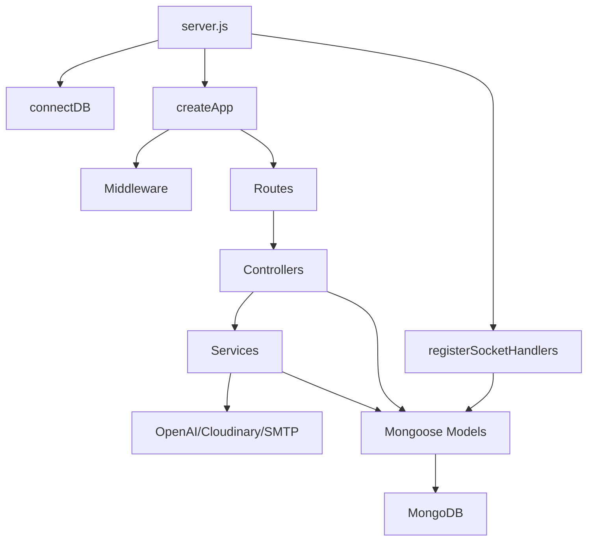
```mermaid
flowchart TD
    server["server.js"]
    db["connectDB"]
    app["createApp"]
    sockets["registerSocketHandlers"]
    routes["Routes"]
    middleware["Middleware"]
    controllers["Controllers"]
    services["Services"]
    models["Mongoose Models"]
    mongo["MongoDB"]
    external["OpenAI/Cloudinary/SMTP"]

    server --> db
    server --> app
    server --> sockets
    app --> middleware
    app --> routes
    routes --> controllers
    controllers --> services
    controllers --> models
    services --> external
    services --> models
    models --> mongo
    sockets --> models
```

### `src/server.js`

Purpose:

- Main backend entry point.
- Connects DB.
- Creates HTTP and Socket.IO servers.
- Starts listening.

Detailed explanation:

```js
import http from "http";
```

Imports Node's built-in HTTP module. Express can run directly, but Socket.IO needs a raw HTTP server to attach to.

```js
import { Server } from "socket.io";
```

Imports Socket.IO server class.

```js
import { connectDB } from "./config/db.js";
```

Imports database connection function.

```js
import { env } from "./config/env.js";
```

Imports central env config.

```js
import { createApp } from "./app.js";
```

Imports Express app factory.

```js
import { registerSocketHandlers } from "./sockets/socketHandler.js";
```

Imports socket event setup.

```js
const bootstrap = async () => {
```

Defines an async startup function. `bootstrap` means start and prepare the application.

```js
  await connectDB();
```

Waits for MongoDB connection before starting the server. This prevents accepting requests when DB is unavailable.

```js
  const httpServer = http.createServer();
```

Creates a raw HTTP server.

```js
  const io = new Server(httpServer, {
    cors: { origin: env.clientUrl, credentials: true }
  });
```

Creates Socket.IO server on top of HTTP server. CORS allows frontend URL to connect.

```js
  const app = createApp(io);
```

Creates Express app and gives it access to Socket.IO.

```js
  httpServer.removeAllListeners("request");
```

Clears existing request listeners. This is defensive. Usually a fresh server has none.

```js
  httpServer.on("request", app);
```

Tells raw HTTP server to send normal HTTP requests to Express.

```js
  registerSocketHandlers(io);
```

Registers socket authentication and events.

```js
  httpServer.listen(env.port, () => {
    console.log(`PulseDesk API listening on port ${env.port}`);
  });
```

Starts backend on configured port.

```js
};
```

Ends bootstrap function.

```js
bootstrap().catch((error) => {
  console.error("Failed to start PulseDesk API", error);
  process.exit(1);
});
```

Runs startup. If startup fails, logs error and exits process with failure code.

### `src/app.js`

Purpose:

- Builds Express application.
- Registers middleware and routes.

Detailed explanation:

Imports:

- `cors`: browser cross-origin permission.
- `express`: API framework.
- `helmet`: security headers.
- `rateLimit`: request limiting.
- `morgan`: request logging.
- `env`: central config.
- route files.
- error handlers.

`createApp(io)`:

- Accepts Socket.IO instance.
- Returns configured Express app.

Middleware order:

1. `helmet()` adds HTTP security headers.
2. `cors()` allows frontend origin.
3. `express.json()` parses JSON bodies.
4. `express.urlencoded()` parses form URL-encoded bodies.
5. `morgan()` logs requests.
6. `rateLimit()` limits requests.
7. Custom middleware attaches `req.io = io`.
8. Routes are registered.
9. Not-found handler.
10. Error handler.

Why order matters:

- Body parser must run before controllers read `req.body`.
- Auth route middleware must run before protected controllers.
- Error handler must be last.

Health route:

```js
app.get("/health", (_req, res) => res.json({ ok: true, service: "PulseDesk API" }));
```

Used to confirm backend is running.

Route mounts:

```js
app.use("/api/auth", authRoutes);
app.use("/api/tickets", ticketRoutes);
app.use("/api/notifications", notificationRoutes);
```

This means:

- `authRoutes` route `/login` becomes `/api/auth/login`.
- `ticketRoutes` route `/` becomes `/api/tickets`.
- `notificationRoutes` route `/` becomes `/api/notifications`.

### `src/config/env.js`

Purpose:

- Loads `.env`.
- Centralizes config.

Important internal behavior:

- `dotenv.config()` reads `.env`.
- `required` array warns if `MONGO_URI` or `JWT_SECRET` missing.
- `env` object normalizes names from uppercase env variables to camelCase JS properties.

Why central config exists:

- Other files do not need to access `process.env` directly.
- Makes config easier to test and maintain.

Fields:

- `nodeEnv`: development/production.
- `port`: backend port.
- `clientUrl`: frontend URL.
- `mongoUri`: MongoDB URI.
- `jwtSecret`: signing secret.
- `jwtExpiresIn`: token lifetime.
- `openAiKey`: OpenAI key.
- `geminiKey`: stored but unused.
- `cloudinary`: nested Cloudinary credentials.
- `smtp`: nested email credentials.

### `src/config/db.js`

Purpose:

- Connects Mongoose to MongoDB.

`mongoose.set("strictQuery", true)`:

- Makes query behavior stricter.

`mongoose.connect(env.mongoUri)`:

- Opens database connection.
- Mongoose keeps this connection for models.

### `src/config/cloudinary.js`

Purpose:

- Configures Cloudinary SDK once.
- Exports configured object.

Used by:

- `uploadService.js`.

### `src/models/User.js`

Purpose:

- Defines users collection schema.
- Handles password hashing and password comparison.

Imports:

- `bcrypt`: password hash/compare.
- `mongoose`: schema/model.
- `validator`: email validation.

Schema fields:

- `name`: required string, trimmed, max length 80.
- `email`: required, unique, lowercase, trimmed, must be valid email.
- `password`: required, minimum 8, hidden by default with `select: false`.
- `role`: enum admin/agent/customer, default customer.
- `avatarUrl`: optional.
- `department`: optional.
- `isActive`: default true.
- `lastSeenAt`: optional date.

Schema option:

- `{ timestamps: true }` automatically adds `createdAt` and `updatedAt`.

Pre-save hook:

```js
userSchema.pre("save", async function hashPassword(next) { ... });
```

- Runs before saving a user.
- Uses normal function, not arrow, because it needs `this`.
- `this` is the user document.
- If password was not changed, it skips.
- If password changed, hashes it with bcrypt cost 12.

Methods:

`comparePassword(candidate)`:

- Compares plain input password with hashed password.
- Used during login.

`toSafeObject()`:

- Converts document to plain object.
- Deletes password.
- Used before sending user to frontend.

Export:

```js
export default mongoose.model("User", userSchema);
```

Creates model named `User`. Mongoose maps it to `users` collection.

### `src/models/Ticket.js`

Purpose:

- Defines support ticket data.

Attachment sub-schema:

- `url`: file URL or placeholder.
- `publicId`: Cloudinary public id.
- `resourceType`: image/pdf/text/etc.
- `originalName`: uploaded filename.
- `size`: file size.
- `{ _id: false }`: attachment objects do not get separate MongoDB `_id`.

Ticket fields:

- `title`: required, trimmed, max 160.
- `description`: required, trimmed.
- `customer`: ObjectId reference to User, required.
- `assignedTo`: ObjectId reference to User.
- `status`: enum, default `open`.
- `priority`: enum, default `medium`.
- `category`: string, default `General`.
- `tags`: array of trimmed strings.
- `attachments`: array of attachment objects.
- `ai`: nested AI result.
- `firstResponseAt`: first staff reply time.
- `resolvedAt`: resolution time.

AI nested object:

- `summary`: AI summary.
- `suggestedReply`: AI reply.
- `sentiment.label`: positive/neutral/negative/angry.
- `sentiment.score`: numeric sentiment score.
- `detectedPriority`: low/medium/high/urgent.

Indexes:

```js
ticketSchema.index({ title: "text", description: "text", tags: "text" });
```

Creates Mongo text index, useful for search. Current frontend search is local, so this index is not actively used by an endpoint yet.

```js
ticketSchema.index({ status: 1, priority: 1, assignedTo: 1 });
```

Speeds filtering by status/priority/assignee.

### `src/models/Message.js`

Purpose:

- Stores chat/reply messages for tickets.

Fields:

- `ticket`: ObjectId ref to Ticket, required.
- `sender`: ObjectId ref to User, required.
- `body`: message text, required and trimmed.
- `attachments`: array of uploaded attachment metadata.
- `isInternal`: true if staff-only/internal note, default false.
- `readBy`: array of User ObjectIds.

Index:

```js
messageSchema.index({ ticket: 1, createdAt: 1 });
```

Speeds loading messages for one ticket in chronological order.

### `src/models/Notification.js`

Purpose:

- Stores user notifications.

Fields:

- `user`: ObjectId ref to User.
- `title`: notification title.
- `body`: notification body.
- `type`: ticket/message/assignment/system.
- `link`: frontend path like `/tickets/:id`.
- `readAt`: date when marked read.

Index:

```js
notificationSchema.index({ user: 1, readAt: 1, createdAt: -1 });
```

Speeds user-specific notification queries.

### `src/utils/apiError.js`

Purpose:

- Custom error class with HTTP status.

Line-by-line:

```js
export class ApiError extends Error {
```

Creates class inheriting from JavaScript Error.

```js
constructor(statusCode, message, details = null) {
```

Constructor receives HTTP status, message, optional details.

```js
super(message);
```

Calls parent Error constructor.

```js
this.statusCode = statusCode;
this.details = details;
```

Stores extra data on error object.

Used by controllers/middleware to throw meaningful API errors.

### `src/utils/asyncHandler.js`

Purpose:

- Prevents repeated try/catch in async controllers.

Code:

```js
export const asyncHandler = (fn) => (req, res, next) => {
  Promise.resolve(fn(req, res, next)).catch(next);
};
```

Explanation:

- `asyncHandler` receives a controller function.
- It returns a new Express middleware function.
- It runs the original function.
- If the promise rejects, `.catch(next)` sends error to Express error handler.

### `src/utils/jwt.js`

Purpose:

- Sign and verify JWT tokens.

`signToken(user)`:

- Creates token payload with:
  - `id: user._id`
  - `role: user.role`
- Signs with `env.jwtSecret`.
- Expires using `env.jwtExpiresIn`.

`verifyToken(token)`:

- Validates token.
- Throws if invalid/expired.
- Returns decoded payload if valid.

### `src/utils/seed.js`

Purpose:

- Creates demo users.

Flow:

- Connects DB.
- Defines three users: admin, agent, customer.
- For each user:
  - Checks if email exists.
  - If exists, updates name, role, password.
  - If not, creates user.
- Password gets hashed by User pre-save hook.
- Exits process.

### `src/middleware/auth.js`

Purpose:

- Protects routes and enforces roles.

`protect`:

- Reads `Authorization` header.
- Extracts token after `Bearer `.
- Throws 401 if missing.
- Verifies JWT.
- Loads user from DB.
- Throws 401 if user missing/inactive.
- Attaches user to `req.user`.
- Calls `next()`.

`authorize(...roles)`:

- Accepts allowed roles.
- Checks `req.user.role`.
- Throws 403 if role not allowed.
- Calls `next()` if allowed.

Example:

```js
authorize("admin", "agent")
```

Only admin and agent can continue.

### `src/middleware/errorHandler.js`

Purpose:

- Handles unknown routes and errors.

`notFound`:

- Creates error for unknown route.
- Sets status 404.
- Passes to next error handler.

`errorHandler`:

- Reads `err.statusCode` or uses 500.
- Builds JSON:
  - `success: false`
  - `message`
  - optional `details`
  - optional stack trace in development.
- Sends response.

### `src/middleware/upload.js`

Purpose:

- Parses file uploads.

`multer.memoryStorage()`:

- Stores files in memory as buffers.
- Does not save to disk.

Limits:

- Max file size: 8 MB.
- Max files: 5.

`fileFilter`:

- Allows files whose mimetype starts with `image/`.
- Allows exact `application/pdf`.
- Allows exact `text/plain`.
- Rejects unsupported types with `ApiError(400, "Unsupported file type")`.

### `src/services/aiService.js`

Purpose:

- Generates AI analysis for tickets.

`openai`:

- Created only if `env.openAiKey` exists.

`priorityRules(text)`:

- Converts text to lowercase.
- Checks urgent keywords:
  - down, outage, breach, security, fraud, cannot login, payment failed.
- Checks high keywords:
  - broken, error, blocked, angry, refund, cancel.
- Returns urgent/high/medium.

`sentimentRules(text)`:

- Checks angry words.
- Checks negative words.
- Checks positive words.
- Returns label and score.

`analyzeTicket({ title, description })`:

- Combines title and description.
- If OpenAI unavailable:
  - Summary is first 220 chars of description.
  - Suggested reply is default response.
  - Sentiment uses fallback rules.
  - Priority uses fallback rules.
- If OpenAI available:
  - Calls chat completions.
  - Model: `gpt-4o-mini`.
  - Temperature: 0.2.
  - Requires JSON object response.
  - Parses response JSON.

Business purpose:

- Helps support staff triage faster.

### `src/services/uploadService.js`

Purpose:

- Uploads files to Cloudinary or returns placeholders.

`uploadBuffer(file)`:

- Creates Promise.
- Uses `cloudinary.uploader.upload_stream`.
- Sends file buffer through Node `Readable.from(file.buffer).pipe(stream)`.
- Resolves Cloudinary upload result.

`uploadFiles(files = [])`:

- If no files, returns empty array.
- Checks if all Cloudinary credentials exist.
- If missing:
  - Returns placeholder metadata.
- If present:
  - Uploads all files in parallel with `Promise.all`.
  - Returns normalized attachment metadata.

Why service exists:

- Controllers do not need to know Cloudinary details.

### `src/services/mailService.js`

Purpose:

- Sends emails.

`transporter`:

- Module-level variable reused after first creation.

`getTransporter()`:

- Returns null if SMTP config missing.
- Otherwise creates Nodemailer transport.
- Reuses existing transport.

`sendMail({ to, subject, html })`:

- Gets transporter.
- If missing, logs `[mail:dev]`.
- If exists, sends email.

### `src/controllers/authController.js`

Purpose:

- Handles auth routes.

`authResponse(user, statusCode, res)`:

- Signs JWT.
- Returns `{ success: true, token, user }`.
- Uses `user.toSafeObject()` to remove password.

`signup(req, res)`:

- Reads name, email, password, role.
- Checks duplicate email.
- Uses safeRole:
  - admin-created users could use requested role.
  - public signup becomes customer.
- Creates user.
- Sends auth response.

`login(req, res)`:

- Reads email/password.
- Finds user by email and includes password.
- Checks password.
- Updates lastSeenAt.
- Sends auth response.

`me(req, res)`:

- Returns authenticated user from `req.user`.
- Requires `protect` middleware before it.

`listUsers(req, res)`:

- Returns all users sorted newest first.
- Staff only through routes.

### `src/controllers/ticketController.js`

Purpose:

- Handles ticket creation, listing, detail, update, assignment, analytics.

`ticketPopulate`:

- Defines Mongoose population rules.
- Replaces customer id and assignedTo id with selected user fields.

`createTicket(req, res)`:

Step-by-step:

1. Upload files with `uploadFiles(req.files)`.
2. Analyze ticket with `analyzeTicket(req.body)`.
3. Priority is user-provided priority or AI detected priority or medium.
4. Create Ticket with title, description, category, customer id, priority, tags, attachments, AI.
5. Create initial Message from ticket description.
6. Find all admin/agent users.
7. Insert notifications for staff.
8. Emit `ticket:created` to `staff` socket room.
9. Return created ticket with populated customer/assignee.

`listTickets(req, res)`:

Builds query by role:

- Customer: only their own tickets.
- Agent: assigned to them or unassigned.
- Admin: all tickets.

Optional filters:

- `status`.
- `priority`.

Returns tickets sorted by `updatedAt` descending.

`getTicket(req, res)`:

- Finds ticket by id and populates users.
- Throws 404 if missing.
- Checks view permission:
  - admin can view.
  - ticket customer can view.
  - assigned agent can view.
  - agent can view unassigned ticket.
- Loads messages for ticket.
- Returns ticket and messages.

`updateTicket(req, res)`:

- Finds ticket.
- Only updates allowed fields:
  - status, priority, category, assignedTo, tags.
- If status becomes resolved, sets `resolvedAt`.
- Saves ticket.
- Emits `ticket:updated` to ticket room and staff room.
- Creates notification for assigned user.
- Returns updated ticket.

`assignTicket(req, res)`:

- Finds ticket.
- Finds assigned user by `agentId`, role agent/admin only.
- Sets assignedTo.
- If ticket was open, changes to `in_progress`.
- Saves ticket.
- Creates assignment notification.
- Sends assignment email.
- Emits staff ticket update.
- Returns updated ticket.

`getAnalytics(req, res)`:

Uses Mongo aggregation:

- Group by status.
- Group by priority.
- Group by sentiment.
- Calculate total/open/resolved/average response time.

### `src/controllers/messageController.js`

Purpose:

- REST endpoint for creating a message.

`createMessage(req, res)`:

- Finds ticket by route param.
- If missing, throws 404.
- If user is customer, checks they own ticket.
- Uploads files.
- Creates message.
- If first staff reply, sets firstResponseAt.
- If customer replies, sets ticket status to open.
- Saves ticket.
- Populates sender.
- Emits `message:created`.
- Returns created message.

### `src/controllers/notificationController.js`

Purpose:

- Notification read/list logic.

`listNotifications(req, res)`:

- Finds notifications for current user.
- Sorts newest first.
- Limits to 50.

`markNotificationRead(req, res)`:

- Finds notification by id and current user.
- Sets `readAt` to current time.
- Returns updated notification.

### `src/routes/authRoutes.js`

Purpose:

- Maps auth URLs to controllers.

Routes:

- `POST /signup` -> signup.
- `POST /login` -> login.
- `GET /me` -> protect -> me.
- `GET /users` -> protect -> authorize admin/agent -> listUsers.

Mounted under `/api/auth`.

### `src/routes/ticketRoutes.js`

Purpose:

- Maps ticket URLs to controllers.

Important:

- `router.use(protect)` protects all routes after it.

Routes:

- `GET /analytics`: staff analytics.
- `GET /`: list tickets.
- `POST /`: upload attachments then create ticket.
- `GET /:id`: get one ticket.
- `PATCH /:id`: staff updates ticket.
- `PATCH /:id/assign`: staff assigns ticket.
- `POST /:ticketId/messages`: create message with attachments.

Mounted under `/api/tickets`.

### `src/routes/notificationRoutes.js`

Purpose:

- Maps notification URLs.

Routes:

- `GET /`: list notifications.
- `PATCH /:id/read`: mark read.

Mounted under `/api/notifications`.

### `src/sockets/socketHandler.js`

Purpose:

- Real-time event handling.

Socket auth middleware:

- Reads `socket.handshake.auth?.token`.
- Verifies JWT.
- Loads user.
- Attaches user to `socket.user`.
- Rejects unauthorized sockets.

On connection:

- Joins personal room `user:<userId>`.
- Staff join `staff` room.

`ticket:join` event:

- Finds ticket.
- Allows staff or owning customer.
- Joins `ticket:<ticketId>` room.

`typing` event:

- Broadcasts typing state to others in same ticket room.

`message:send` event:

- Ignores empty body.
- Finds ticket.
- Creates message.
- Populates sender.
- Emits `message:created` to ticket room.

Security note:

- `message:send` verifies ticket exists, but unlike `ticket:join`, it does not fully re-check customer ownership before creating the message. This should be tightened.

---

## Section 7: Database Analysis

Database:

- MongoDB.
- ODM: Mongoose.
- Collections are created from models.

### Entities

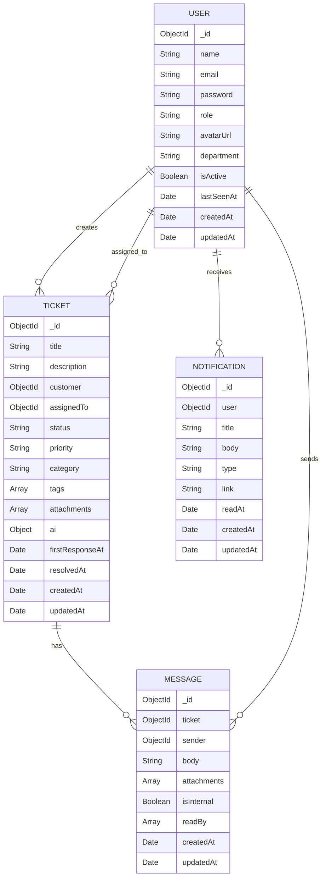
```mermaid
erDiagram
    USER ||--o{ TICKET : creates
    USER ||--o{ TICKET : assigned_to
    TICKET ||--o{ MESSAGE : has
    USER ||--o{ MESSAGE : sends
    USER ||--o{ NOTIFICATION : receives

    USER {
        ObjectId _id
        String name
        String email
        String password
        String role
        String avatarUrl
        String department
        Boolean isActive
        Date lastSeenAt
        Date createdAt
        Date updatedAt
    }

    TICKET {
        ObjectId _id
        String title
        String description
        ObjectId customer
        ObjectId assignedTo
        String status
        String priority
        String category
        Array tags
        Array attachments
        Object ai
        Date firstResponseAt
        Date resolvedAt
        Date createdAt
        Date updatedAt
    }

    MESSAGE {
        ObjectId _id
        ObjectId ticket
        ObjectId sender
        String body
        Array attachments
        Boolean isInternal
        Array readBy
        Date createdAt
        Date updatedAt
    }

    NOTIFICATION {
        ObjectId _id
        ObjectId user
        String title
        String body
        String type
        String link
        Date readAt
        Date createdAt
        Date updatedAt
    }
```

### User Collection

Purpose:

- Stores authenticated people.

Constraints:

- `email` is unique.
- `email` must be valid.
- `password` minimum 8 chars.
- `role` must be admin/agent/customer.

Relationships:

- User creates many tickets as customer.
- User can be assigned many tickets.
- User sends many messages.
- User receives many notifications.

### Ticket Collection

Purpose:

- Stores support cases.

Relationships:

- `customer` references User.
- `assignedTo` references User.
- Has many messages.

Indexes:

- Text index on title/description/tags.
- Compound index on status/priority/assignedTo.

### Message Collection

Purpose:

- Stores ticket chat/replies.

Relationships:

- Belongs to Ticket.
- Sent by User.

Index:

- `ticket + createdAt` for chat ordering.

### Notification Collection

Purpose:

- Stores alerts per user.

Relationship:

- Belongs to User.

Index:

- `user + readAt + createdAt`.

### Data Movement

Ticket creation:

```text
User form -> Ticket document -> Message document -> Notification documents
```

Chat:

```text
Socket event -> Message document -> Socket broadcast
```

Analytics:

```text
Ticket collection -> Mongo aggregation -> dashboard charts/cards
```

---

## Section 8: Authentication and Authorization

### Login Flow

1. User enters credentials.
2. Frontend calls `/api/auth/login`.
3. Backend finds user by email.
4. Backend compares password with bcrypt.
5. Backend signs JWT.
6. Frontend stores token.
7. Future requests include token.

### JWT Generation

Created by:

```js
signToken(user)
```

Payload:

```json
{
  "id": "user MongoDB id",
  "role": "admin/agent/customer"
}
```

Secret:

```text
JWT_SECRET
```

Expiry:

```text
JWT_EXPIRES_IN
```

### JWT Validation

REST:

- `protect` middleware reads `Authorization` header.
- Verifies token.
- Loads full user from DB.

Socket:

- Socket middleware reads `socket.handshake.auth.token`.
- Verifies token.
- Loads user from DB.

### Role Permissions

Customer:

- Can create tickets.
- Can view own tickets.
- Can reply to own tickets.

Agent:

- Can view tickets assigned to them or unassigned tickets.
- Can update ticket status/priority.
- Can view analytics.
- Can view users.

Admin:

- Can view all tickets.
- Can update all tickets.
- Can view analytics.
- Can view users.

### Auth Diagram

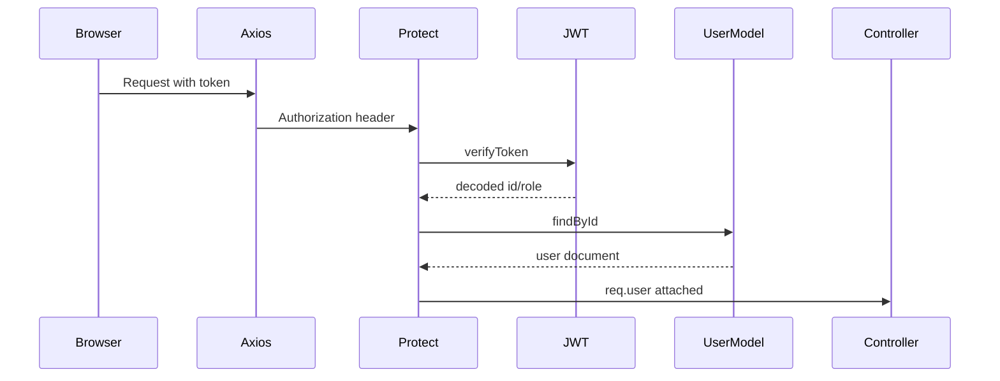
```mermaid
sequenceDiagram
    participant Browser
    participant Axios
    participant Protect
    participant JWT
    participant UserModel
    participant Controller

    Browser->>Axios: Request with token
    Axios->>Protect: Authorization header
    Protect->>JWT: verifyToken
    JWT-->>Protect: decoded id/role
    Protect->>UserModel: findById
    UserModel-->>Protect: user document
    Protect->>Controller: req.user attached
```

---

## Section 9: API Documentation

Base URL locally:

```text
http://localhost:5000/api
```

Auth header for protected routes:

```text
Authorization: Bearer <jwt_token>
```

### POST `/api/auth/signup`

Purpose:

- Register a user.

Body:

```json
{
  "name": "Customer User",
  "email": "customer@example.com",
  "password": "Password123"
}
```

Response 201:

```json
{
  "success": true,
  "token": "jwt",
  "user": {
    "_id": "id",
    "name": "Customer User",
    "email": "customer@example.com",
    "role": "customer"
  }
}
```

Errors:

- 409 email already registered.
- 500 validation/internal errors.

### POST `/api/auth/login`

Body:

```json
{
  "email": "admin@pulsedesk.dev",
  "password": "Password123"
}
```

Response 200:

```json
{
  "success": true,
  "token": "jwt",
  "user": {
    "_id": "id",
    "name": "Admin User",
    "email": "admin@pulsedesk.dev",
    "role": "admin"
  }
}
```

Errors:

- 401 invalid email or password.

### GET `/api/auth/me`

Headers:

- Bearer token required.

Response:

```json
{
  "success": true,
  "user": {}
}
```

### GET `/api/auth/users`

Access:

- Admin/agent only.

Response:

```json
{
  "success": true,
  "users": []
}
```

### GET `/api/tickets`

Access:

- Authenticated users.

Query parameters:

- `status`
- `priority`

Role behavior:

- Customer: own tickets.
- Agent: assigned or unassigned tickets.
- Admin: all tickets.

Response:

```json
{
  "success": true,
  "tickets": []
}
```

### POST `/api/tickets`

Access:

- Authenticated users.

Content type:

```text
multipart/form-data
```

Fields:

- `title`: required.
- `description`: required.
- `category`: optional.
- `priority`: optional.
- `tags`: optional comma-separated string.
- `attachments`: optional files, max 5.

Response 201:

```json
{
  "success": true,
  "ticket": {}
}
```

### GET `/api/tickets/:id`

Access:

- Admin.
- Ticket customer.
- Assigned agent.
- Agent if ticket unassigned.

Response:

```json
{
  "success": true,
  "ticket": {},
  "messages": []
}
```

### PATCH `/api/tickets/:id`

Access:

- Admin/agent only.

Body:

```json
{
  "status": "in_progress",
  "priority": "high",
  "category": "Billing",
  "tags": ["billing", "refund"]
}
```

Allowed update fields:

- status.
- priority.
- category.
- assignedTo.
- tags.

Response:

```json
{
  "success": true,
  "ticket": {}
}
```

### PATCH `/api/tickets/:id/assign`

Access:

- Admin/agent only.

Body:

```json
{
  "agentId": "user_id"
}
```

Response:

```json
{
  "success": true,
  "ticket": {}
}
```

### POST `/api/tickets/:ticketId/messages`

Access:

- Authenticated users.

Content type:

- Multipart when files are included.

Fields:

- `body`: message body.
- `attachments`: optional files.
- `isInternal`: optional, staff only.

Response 201:

```json
{
  "success": true,
  "message": {}
}
```

### GET `/api/tickets/analytics`

Access:

- Admin/agent only.

Response:

```json
{
  "success": true,
  "analytics": {
    "totals": {},
    "byStatus": [],
    "byPriority": [],
    "bySentiment": []
  }
}
```

### GET `/api/notifications`

Access:

- Authenticated users.

Response:

```json
{
  "success": true,
  "notifications": []
}
```

### PATCH `/api/notifications/:id/read`

Access:

- Authenticated users.

Response:

```json
{
  "success": true,
  "notification": {}
}
```

---

## Section 10: Integrations

### MongoDB

Purpose:

- Store users, tickets, messages, notifications.

Configuration:

- `MONGO_URI`.

Authentication:

- Local MongoDB may not need auth.
- Atlas uses username/password in URI.

Failure scenarios:

- Backend startup fails if DB unavailable.
- Seed fails if DB unavailable.

### OpenAI

Purpose:

- AI ticket analysis.

Configuration:

- `OPENAI_API_KEY`.

Request:

- Chat completion request with title/description.
- Requests JSON object.

Response:

- summary.
- suggestedReply.
- sentiment.
- detectedPriority.

Failure scenarios:

- Missing key: fallback rules are used.
- Invalid JSON response: `JSON.parse` can fail and create 500 error.
- Network/API error: ticket creation can fail.

Improvement:

- Wrap OpenAI call in try/catch and fallback to local rules.

### Gemini

Purpose:

- Key exists in env, but no integration code currently uses it.

Status:

- Not implemented.

### Cloudinary

Purpose:

- File/media storage.

Configuration:

- `CLOUDINARY_CLOUD_NAME`.
- `CLOUDINARY_API_KEY`.
- `CLOUDINARY_API_SECRET`.

Request:

- Backend streams file buffer to Cloudinary.

Response:

- Secure URL, public id, resource type.

Failure scenarios:

- Missing credentials: local placeholder fallback.
- Upload error: request fails.

### Nodemailer/SMTP

Purpose:

- Assignment emails.

Configuration:

- SMTP host, port, user, pass, from.

Failure scenarios:

- Missing credentials: logs only.
- Invalid SMTP: email send fails and assignment route can fail.

### Socket.IO

Purpose:

- Real-time chat, typing, ticket updates.

Authentication:

- JWT passed through socket auth.

Failure scenarios:

- Missing/invalid token: socket connection rejected.
- Backend unavailable: frontend still loads, realtime unavailable.

---

## Section 11: DevOps and Deployment

### Current DevOps Status

Present:

- Vercel config.
- Render config.
- Env examples.
- npm scripts.
- Git repository.

Not present:

- Dockerfile.
- docker-compose.yml.
- CI/CD pipeline.
- Automated backend tests.
- Automated frontend tests.

### Local Environment Variables

Backend minimum:

```env
NODE_ENV=development
PORT=5000
CLIENT_URL=http://localhost:5173
MONGO_URI=mongodb://127.0.0.1:27017/pulsedesk
JWT_SECRET=make-this-a-long-random-secret
JWT_EXPIRES_IN=7d
```

Frontend:

```env
VITE_API_URL=http://localhost:5000/api
VITE_SOCKET_URL=http://localhost:5000
```

### Local Run Commands With Current Folder Names

Install backend:

```powershell
cd E:\PulseDesk\pulseDeskBackEnd
npm.cmd install
```

Install frontend:

```powershell
cd E:\PulseDesk\pulseDeskFrontEnd
npm.cmd install
```

Start MongoDB:

```powershell
net start MongoDB
```

Seed demo users:

```powershell
cd E:\PulseDesk\pulseDeskBackEnd
npm.cmd run seed
```

Start backend:

```powershell
cd E:\PulseDesk\pulseDeskBackEnd
npm.cmd run dev
```

Start frontend:

```powershell
cd E:\PulseDesk\pulseDeskFrontEnd
npm.cmd run dev
```

Open:

```text
http://localhost:5173
```

Health check:

```text
http://localhost:5000/health
```

### Vercel Deployment

Frontend project root:

```text
pulseDeskFrontEnd
```

Build command:

```text
npm run build
```

Output directory:

```text
dist
```

Env:

```env
VITE_API_URL=https://your-render-api.onrender.com/api
VITE_SOCKET_URL=https://your-render-api.onrender.com
```

### Render Deployment

Backend root should be:

```text
pulseDeskBackEnd
```

Update `render.yaml`:

```yaml
rootDir: pulseDeskBackEnd
```

Build command:

```text
npm install
```

Start command:

```text
npm start
```

Production env:

- `NODE_ENV=production`
- `CLIENT_URL`
- `MONGO_URI`
- `JWT_SECRET`
- `OPENAI_API_KEY`
- Cloudinary keys.
- SMTP settings.

### Docker

No Docker files exist.

If adding Docker:

- Backend Dockerfile should install dependencies and run `npm start`.
- Frontend Dockerfile can build static assets and serve with nginx.
- docker-compose can include MongoDB service.

### CI/CD

No CI exists.

Recommended GitHub Actions:

- Install backend deps.
- Run backend syntax/tests.
- Install frontend deps.
- Run frontend lint.
- Run frontend build.
- Optionally run npm audit.

---

## Section 12: Code Quality Review

### Bad Practices / Risks

1. Root workspace config is stale after folder rename.

Impact:

- `npm run dev` at root may not work.

Fix:

- Update root `package.json` workspaces and scripts.

2. JWT stored in localStorage.

Impact:

- Vulnerable if XSS happens.

Fix:

- Consider httpOnly secure cookies for production.

3. Socket message send does not fully enforce ticket ownership.

Impact:

- A connected user may send message to a ticket if they know id.

Fix:

- Add same permission logic as `getTicket`.

4. AI OpenAI call has no fallback on API failure.

Impact:

- Ticket creation can fail if OpenAI key is set but API fails.

Fix:

- Wrap in try/catch and fallback to local rules.

5. Assignment UI missing.

Impact:

- Backend supports assignment but frontend cannot easily assign.

Fix:

- Add staff assignment dropdown.

6. Gemini env exists but code does not use it.

Impact:

- Confusion about whether Gemini is implemented.

Fix:

- Implement Gemini or remove env key.

7. README/render config use old folder names.

Impact:

- Deployment/local setup confusion.

Fix:

- Update documentation/config.

8. No tests.

Impact:

- Regressions harder to catch.

Fix:

- Add backend route tests and frontend component tests.

9. `TicketDetail.jsx` has encoding artifact `·`.

Impact:

- UI displays corrupted text.

Fix:

- Replace with ASCII separator.

10. File upload placeholders are not real downloadable files.

Impact:

- Local upload metadata exists but files are not accessible.

Fix:

- Add local disk storage in development or require Cloudinary.

### Performance Issues

- Dashboard analytics aggregates all tickets each request.
- Ticket list fetches all matching tickets without pagination.
- Notifications limited to 50, good.
- Messages fetch all messages for a ticket, no pagination.

### Scalability Improvements

- Add pagination to tickets and messages.
- Add server-side search using text index.
- Add socket permission checks.
- Add background jobs for AI/email.
- Add indexes for `customer`, `createdAt`, `updatedAt`.
- Add Redis adapter for Socket.IO multi-instance scaling.

---

## Section 13: Debugging Guide

### Backend Will Not Start

Check:

```powershell
cd E:\PulseDesk\pulseDeskBackEnd
npm.cmd run dev
```

Common causes:

- MongoDB not running.
- `.env` missing.
- `MONGO_URI` wrong.
- Port 5000 already used.

Debug:

```text
http://localhost:5000/health
```

### Frontend Will Not Start

Check:

```powershell
cd E:\PulseDesk\pulseDeskFrontEnd
npm.cmd run dev
```

Common causes:

- Dependencies not installed.
- Port 5173 used.
- `.env` missing.

### Login Fails

Check:

- Did you seed users?
- Is backend running?
- Is MongoDB connected?
- Is frontend `VITE_API_URL` correct?

Seed:

```powershell
cd E:\PulseDesk\pulseDeskBackEnd
npm.cmd run seed
```

Demo:

```text
admin@pulsedesk.dev / Password123
```

### API 401

Meaning:

- Missing/invalid JWT.

Check:

- Browser localStorage has `pulsedesk_token`.
- Token not expired.
- Backend `JWT_SECRET` unchanged since token was created.

Fix:

- Logout/login again.

### Upload Fails

Check:

- File type is image/pdf/text.
- File size below 8 MB.
- No more than 5 files.
- Cloudinary credentials valid if using real upload.

### Socket Chat Fails

Check:

- Backend running.
- `VITE_SOCKET_URL` correct.
- JWT token exists.
- Ticket detail page emitted `ticket:join`.

### Notifications Not Appearing

Check:

- Notifications are created on new tickets/updates/assignment.
- User is correct recipient.
- Notifications page calls backend successfully.

### AI Not Working

If no OpenAI key:

- Fallback rules are expected.

If OpenAI key exists:

- Check key validity.
- Check API billing/access.
- Check backend logs.

---

## Section 14: Interview Preparation

### 50 Beginner Questions and Answers

1. What is PulseDesk? A MERN customer support ticket platform with AI and real-time chat.
2. What is MERN? MongoDB, Express, React, Node.js.
3. What does React do? Builds the browser UI.
4. What does Express do? Handles backend API routes.
5. What does MongoDB store? Users, tickets, messages, notifications.
6. What is Mongoose? ODM that defines schemas/models for MongoDB.
7. What is JWT? A signed token used for authentication.
8. Where is the backend entry point? `pulseDeskBackEnd/src/server.js`.
9. Where is the frontend entry point? `pulseDeskFrontEnd/src/main.jsx`.
10. What is `.env` used for? Runtime configuration and secrets.
11. What is `AuthContext`? React context for login/user/token state.
12. What is `ProtectedRoute`? Route guard for logged-in users.
13. What is Axios used for? HTTP API calls.
14. What is Socket.IO used for? Real-time chat and live updates.
15. What is bcrypt used for? Password hashing and comparison.
16. What is Cloudinary used for? File/media uploads.
17. What is Nodemailer used for? Sending emails.
18. What is OpenAI used for? AI ticket analysis.
19. Is Gemini implemented? No, only env key exists.
20. What is a controller? Function that handles route business logic.
21. What is middleware? Function that runs during request processing.
22. What is a model? Mongoose representation of a MongoDB collection.
23. What is a route file? File that maps URL paths to controllers.
24. What is `useState`? React hook for component state.
25. What is `useEffect`? React hook for side effects like API calls.
26. What is `useMemo`? React hook for memoized computed values.
27. What is `useContext`? React hook to read context data.
28. What is Tailwind? Utility CSS framework.
29. What is Vite? Frontend development/build tool.
30. What is CORS? Browser rule controlling cross-origin requests.
31. What is Helmet? Express middleware for security headers.
32. What is Morgan? HTTP request logger.
33. What is rate limiting? Restricting too many requests.
34. What is Multer? Express file upload parser.
35. What is a ticket status? Current lifecycle state of a ticket.
36. What priorities exist? low, medium, high, urgent.
37. What roles exist? admin, agent, customer.
38. What is `localStorage`? Browser storage used for token.
39. What is `FormData`? Browser object for sending form fields/files.
40. What is `populate` in Mongoose? Replaces ObjectId with referenced document data.
41. What is `createdAt`? Timestamp when document was created.
42. What is `updatedAt`? Timestamp when document was last changed.
43. What does `seed.js` do? Creates demo users.
44. What is `/health`? Simple backend status route.
45. What is `render.yaml`? Render deployment config.
46. What is `vercel.json`? Vercel frontend routing config.
47. What is `npm install`? Installs dependencies.
48. What is `npm run dev`? Starts development server.
49. What is a socket room? Group for broadcasting socket events.
50. Why use services? To keep external integration logic separate from controllers.

### 50 Intermediate Questions and Answers

1. How does login work end to end? React form calls auth context, Axios posts to backend, backend validates bcrypt password, signs JWT, frontend stores token.
2. Why is password `select: false`? To avoid accidentally returning password hashes.
3. How does backend know current user? `protect` verifies token and attaches `req.user`.
4. How are staff routes protected? `authorize("admin", "agent")`.
5. How are tickets filtered by role? Customer sees own, agent sees assigned/unassigned, admin sees all.
6. Why is `asyncHandler` useful? It sends async errors to centralized error middleware.
7. How are files uploaded? Multer parses memory buffers, upload service streams to Cloudinary.
8. What happens if Cloudinary is not configured? Local placeholder URLs are returned.
9. How does AI fallback work? Keyword rules classify priority/sentiment and default reply is returned.
10. How are analytics calculated? MongoDB aggregation groups tickets by status/priority/sentiment and averages response time.
11. How does Socket.IO authenticate? Token is sent in `handshake.auth.token` and verified.
12. What is the staff room? Socket room for admin/agent users.
13. What is a ticket room? Socket room named `ticket:<id>`.
14. Why attach `req.io`? Controllers can emit socket events after REST updates.
15. Why use `FormData` in new ticket? To send files and fields together.
16. Why use `useMemo` in dashboard/tickets? To avoid recalculating derived data unnecessarily.
17. Why use `BrowserRouter`? To support client-side routes.
18. Why does Vercel need rewrites? React Router routes need to return `index.html`.
19. What is `lastSeenAt`? Login timestamp.
20. Why create an initial message when ticket is created? The original description becomes first conversation entry.
21. Why store AI data inside ticket? It belongs to ticket triage and is loaded with ticket.
22. What happens when a staff member replies? `firstResponseAt` is set if it was empty.
23. What happens when status becomes resolved? `resolvedAt` is set.
24. What does `insertMany` do? Inserts many notifications at once.
25. What does `findOneAndUpdate` do? Finds and updates document in one operation.
26. How are attachments represented? URL, publicId, resourceType, originalName, size.
27. What is the main auth security weakness? JWT in localStorage.
28. What is the current socket security weakness? `message:send` lacks full permission check.
29. Why are root scripts currently risky? They still point to old folder names.
30. What does `NODE_ENV` affect? Logging/error stack behavior and production mode.
31. What does `CLIENT_URL` affect? CORS and Socket.IO allowed origin.
32. What does `JWT_SECRET` affect? Signing and verifying tokens.
33. What breaks if JWT secret changes? Existing tokens become invalid.
34. How are notifications marked read? `readAt` is set to current date.
35. What is a compound index? Index on multiple fields.
36. Why use MongoDB text index? To support future server-side search.
37. How does login survive page refresh? AuthProvider reads token from localStorage and calls `/auth/me`.
38. Why call `populate`? Frontend needs user names/emails, not only ids.
39. Why is `isInternal` not fully used? Backend supports it, frontend lacks toggle/display logic.
40. What is the deployment difference between Vercel and Render? Vercel serves frontend, Render runs backend server.
41. Why is `helmet` useful? Adds safer HTTP headers.
42. Why rate limit? Prevent basic abuse.
43. Why does upload middleware run before controller? It parses files into `req.files`.
44. What is `req.body`? Parsed request body fields.
45. What is `req.params`? URL dynamic values like `:id`.
46. What is `req.query`? URL query parameters.
47. What is `res.json`? Sends JSON response.
48. What is `next`? Express function to continue middleware chain.
49. Why use module-level transporter? Reuse SMTP connection config.
50. What is one good first improvement? Fix folder names in root package/README/render config.

### 50 Advanced Questions and Answers

1. How would you scale Socket.IO horizontally? Use Redis adapter and sticky sessions or compatible load balancing.
2. How would you secure JWT better? Use httpOnly secure cookies, CSRF protection, refresh tokens.
3. How would you add server-side ticket search? Add `q` query param and use `$text: { $search: q }`.
4. How would you make AI non-blocking? Move AI analysis to a job queue and update ticket asynchronously.
5. How would you improve OpenAI reliability? Add try/catch fallback, schema validation, retries, timeout.
6. How would you add assignment UI? Fetch staff users and PATCH `/tickets/:id/assign`.
7. How would you prevent unauthorized socket messages? Reuse ticket permission logic before creating message.
8. How would you paginate tickets? Add `page`, `limit`, `skip`, total count.
9. How would you paginate messages? Query by ticket with cursor/createdAt.
10. How would you add tests? Jest/Vitest for services/controllers, Supertest for API, React Testing Library for UI.
11. How would you avoid storing local placeholders? Add local disk upload storage for dev or require Cloudinary.
12. How would you add audit logs? Create AuditLog model and write on ticket/status/assignment changes.
13. How would you validate request bodies? Use Zod/Joi middleware.
14. How would you handle file virus scanning? Queue uploads and scan before marking safe.
15. How would you handle large attachments? Stream directly to cloud storage instead of memory buffer.
16. Why can memory upload be risky? Large files consume server RAM.
17. How would you add tenant support? Add organization model and organizationId to every entity.
18. How would you add SLA tracking? Store dueAt/escalation fields and scheduled checks.
19. How would you add email replies into tickets? Use inbound email provider webhook.
20. How would you add OAuth? Add passport/Auth0/Clerk or OAuth provider flow.
21. How would you protect against XSS? Sanitize content, avoid dangerous HTML, CSP headers.
22. How would you protect against NoSQL injection? Validate/sanitize inputs and avoid passing raw objects.
23. How would you improve role design? Use permissions array or policy middleware.
24. How would you cache analytics? Redis or precomputed metrics updated on ticket changes.
25. How would you add observability? Structured logs, metrics, tracing, error monitoring.
26. How would you make deployment safer? CI/CD with lint/build/test before deploy.
27. How would you deploy MongoDB? Atlas with least-privileged DB user and IP/network rules.
28. How would you handle secret rotation? Update env and force token re-login if JWT secret changes.
29. How would you implement Gemini? Add Gemini SDK/service branch in aiService or provider abstraction.
30. How would you make AI provider pluggable? Define `analyzeTicket` interface and provider adapters.
31. How would you improve notifications? Add socket `notification:created` and unread count.
32. How would you add read receipts? Update `readBy` when messages are viewed.
33. How would you add internal notes? Frontend toggle and hide internal messages from customers.
34. How would you prevent duplicate socket messages? Use client temporary ids and server acknowledgement.
35. How would you handle optimistic UI? Add local message immediately then reconcile with server result.
36. How would you add refresh tokens? Store refresh token in httpOnly cookie, short-lived access token.
37. How would you add RBAC policies? Create policy functions per resource/action.
38. How would you enforce ownership globally? Resource-loading middleware with permission checks.
39. How would you handle schema migrations? Use migration scripts or versioned updates.
40. How would you validate env? Use a schema at startup and fail fast in production.
41. How would you handle rate limits per route? Configure stricter limits for auth routes.
42. How would you implement password reset? Token model, email link, expiry, reset endpoint.
43. How would you add email verification? Verification token and verifiedAt field.
44. How would you make tickets searchable by customer? Add backend filters and indexes.
45. How would you avoid frontend prop drilling? Context, custom hooks, or state library.
46. How would you improve accessibility? Labels, keyboard navigation, aria states, contrast checks.
47. How would you add dark mode? Tailwind dark class and theme state.
48. How would you prevent CORS production mistakes? Exact allowed origins list.
49. How would you handle DB connection retry? Add retry/backoff before process exit.
50. What is the biggest production gap? Missing tests, stale root config, and auth/socket hardening.

---

## Section 15: Rebuild Guide

### Rebuild From Scratch

1. Create root folder:

```powershell
mkdir E:\PulseDesk
cd E:\PulseDesk
```

2. Create backend:

```powershell
mkdir pulseDeskBackEnd
cd pulseDeskBackEnd
npm.cmd init -y
```

3. Install backend dependencies:

```powershell
npm.cmd install bcryptjs cloudinary cors dotenv express express-rate-limit helmet jsonwebtoken mongoose morgan multer nodemailer openai socket.io validator
npm.cmd install -D nodemon
```

4. Set backend `package.json`:

- `type: module`.
- scripts: dev/start/seed.

5. Create backend folders:

```powershell
mkdir src, src\config, src\controllers, src\middleware, src\models, src\routes, src\services, src\sockets, src\utils
```

6. Create backend files in this order:

- `src/config/env.js`.
- `src/config/db.js`.
- `src/config/cloudinary.js`.
- `src/models/User.js`.
- `src/models/Ticket.js`.
- `src/models/Message.js`.
- `src/models/Notification.js`.
- `src/utils/apiError.js`.
- `src/utils/asyncHandler.js`.
- `src/utils/jwt.js`.
- `src/middleware/auth.js`.
- `src/middleware/errorHandler.js`.
- `src/middleware/upload.js`.
- `src/services/aiService.js`.
- `src/services/uploadService.js`.
- `src/services/mailService.js`.
- controllers.
- routes.
- `src/sockets/socketHandler.js`.
- `src/app.js`.
- `src/server.js`.
- `src/utils/seed.js`.

7. Create backend `.env.example` and `.env`.

8. Create frontend:

```powershell
cd E:\PulseDesk
npm.cmd create vite@latest pulseDeskFrontEnd -- --template react
cd pulseDeskFrontEnd
```

9. Install frontend dependencies:

```powershell
npm.cmd install axios clsx lucide-react react-router-dom socket.io-client
npm.cmd install -D tailwindcss postcss autoprefixer eslint eslint-plugin-react eslint-plugin-react-hooks
```

10. Initialize Tailwind/PostCSS:

```powershell
npx.cmd tailwindcss init -p
```

11. Create frontend folders:

```powershell
mkdir src\api, src\components, src\context, src\hooks, src\layouts, src\pages, src\utils
```

12. Create frontend files:

- `src/main.jsx`.
- `src/App.jsx`.
- `src/index.css`.
- `src/api/http.js`.
- `src/context/AuthContext.jsx`.
- `src/hooks/useSocket.js`.
- components.
- layout.
- pages.
- utils.

13. Create frontend `.env.example` and `.env`.

14. Start MongoDB.

15. Seed users.

16. Start backend.

17. Start frontend.

18. Test login, create ticket, ticket list, ticket detail, chat, notifications, dashboard.

19. Push to GitHub.

20. Deploy frontend to Vercel and backend to Render.

---

## Section 16: Knowledge Map

### Beginner Learning Roadmap

1. JavaScript basics:
   - variables.
   - functions.
   - arrays.
   - objects.
   - async/await.

2. React basics:
   - components.
   - props.
   - state.
   - events.
   - forms.

3. React Router:
   - routes.
   - Navigate.
   - Outlet.
   - useNavigate.
   - useParams.

4. HTTP:
   - GET/POST/PATCH.
   - request body.
   - headers.
   - status codes.

5. Express:
   - app.
   - routes.
   - middleware.
   - controllers.

### Intermediate Learning Roadmap

1. MongoDB:
   - documents.
   - collections.
   - ObjectId.

2. Mongoose:
   - schemas.
   - models.
   - validation.
   - hooks.
   - populate.

3. Auth:
   - password hashing.
   - JWT.
   - authorization.
   - route guards.

4. File uploads:
   - FormData.
   - multipart.
   - Multer.
   - Cloudinary.

5. Real-time:
   - Socket.IO.
   - events.
   - rooms.
   - auth.

### Advanced Learning Roadmap

1. Security:
   - XSS.
   - CSRF.
   - JWT storage.
   - role-based access.
   - input validation.

2. Architecture:
   - service layer.
   - DTO validation.
   - repositories.
   - domain models.

3. Scaling:
   - pagination.
   - indexing.
   - Redis.
   - queues.
   - horizontal Socket.IO.

4. DevOps:
   - Docker.
   - CI/CD.
   - Vercel.
   - Render.
   - MongoDB Atlas.

5. Testing:
   - unit tests.
   - integration tests.
   - E2E tests.

---

## Section 17: Visualization

### Ticket State Diagram

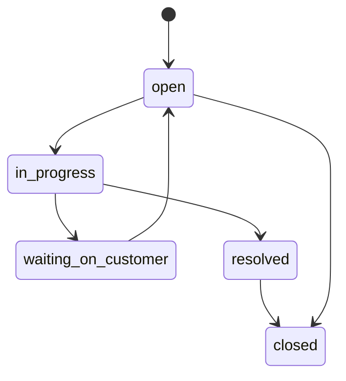
```mermaid
stateDiagram-v2
    [*] --> open
    open --> in_progress
    in_progress --> waiting_on_customer
    waiting_on_customer --> open
    in_progress --> resolved
    resolved --> closed
    open --> closed
```

### Dependency Graph

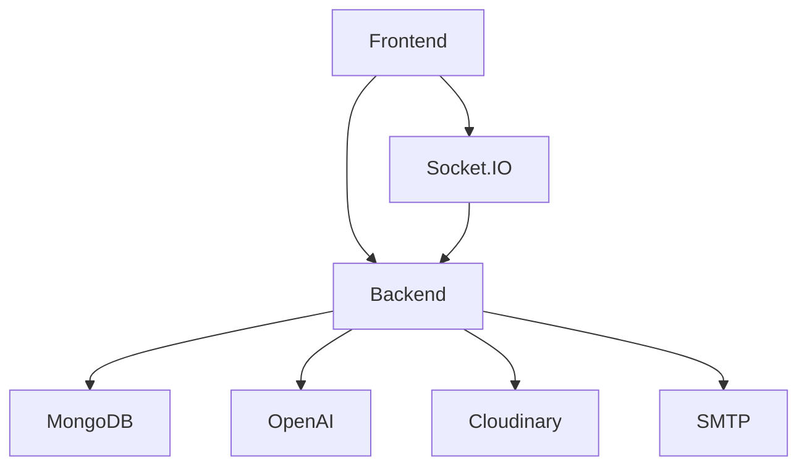
```mermaid
flowchart TD
    FE["Frontend"]
    BE["Backend"]
    DB["MongoDB"]
    AI["OpenAI"]
    UP["Cloudinary"]
    MAIL["SMTP"]
    RT["Socket.IO"]

    FE --> BE
    FE --> RT
    BE --> DB
    BE --> AI
    BE --> UP
    BE --> MAIL
    RT --> BE
```

### Backend Class/Model Diagram

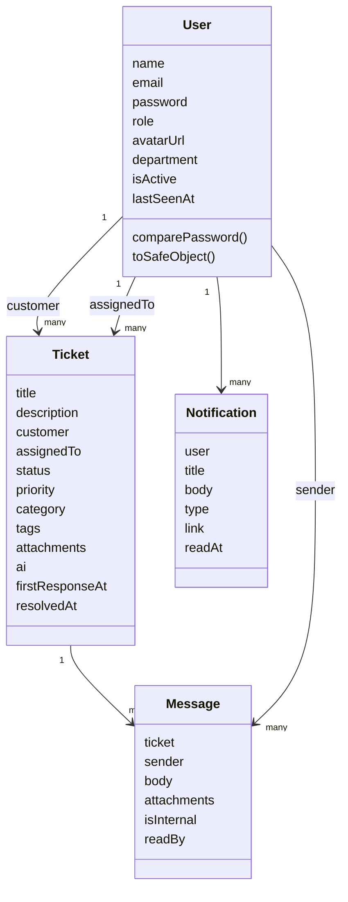
```mermaid
classDiagram
    class User {
        name
        email
        password
        role
        avatarUrl
        department
        isActive
        lastSeenAt
        comparePassword()
        toSafeObject()
    }
    class Ticket {
        title
        description
        customer
        assignedTo
        status
        priority
        category
        tags
        attachments
        ai
        firstResponseAt
        resolvedAt
    }
    class Message {
        ticket
        sender
        body
        attachments
        isInternal
        readBy
    }
    class Notification {
        user
        title
        body
        type
        link
        readAt
    }
    User "1" --> "many" Ticket : customer
    User "1" --> "many" Ticket : assignedTo
    Ticket "1" --> "many" Message
    User "1" --> "many" Message : sender
    User "1" --> "many" Notification
```

### Frontend State Flow

```mermaid
flowchart TD
    LocalStorage["localStorage pulsedesk_token"]
    AuthProvider["AuthProvider"]
    Http["Axios http.js"]
    Pages["Pages"]
    Protected["ProtectedRoute"]
    Socket["useSocket"]

    LocalStorage --> AuthProvider
    AuthProvider --> Protected
    AuthProvider --> Pages
    AuthProvider --> Socket
    Pages --> Http
    Http --> LocalStorage
```

---

## Final Ownership Notes

To fully own this codebase, know these facts clearly:

- The backend is Express plus Mongoose.
- The database is MongoDB.
- The frontend is React plus Vite.
- Auth uses JWT and bcrypt.
- Real-time uses Socket.IO.
- AI currently uses OpenAI only when configured.
- Gemini is not implemented.
- Cloudinary and SMTP are optional integrations.
- Folder rename caused stale root configs.
- The app works as a strong foundation, but production hardening should include tests, validation, socket permission fixes, pagination, better token storage, and updated deployment configs.

